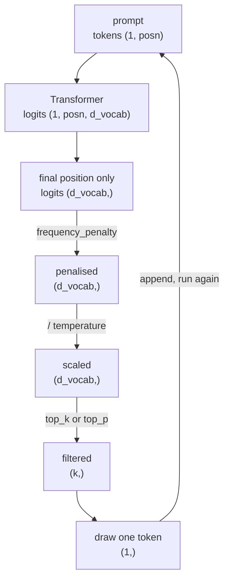
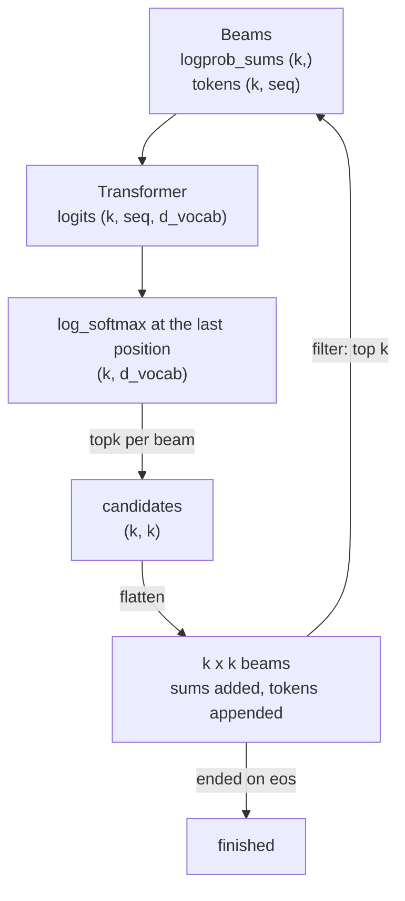

The last two posts built a transformer and trained one. In the [Training a Transformer]({filename}training-a-transformer.md) post, I used TransformerLens's sampler on the TinyStories weights I trained. This post ports the sampler, using the techniques from the ARENA curriculum: `greedy_search`, `apply_temperature`, `apply_frequency_penalty`, `sample_basic`, `sample_top_k` and `sample_top_p`, plus `beam_search`.

PvML: https://github.com/d0mzw/PvML

Disclaimer: these notes come from working through the ARENA 3.0 curriculum. I claim no credit for the original material, and this is not affiliated with or endorsed by ARENA.

## Sampler



The forward pass is the one from training, frozen in place. It still emits a score over all 50,257 vocabulary entries at every position, and generation needs only the last, so the rest are discarded every step.

```
src/pvml/sampling/
    strategies.py    six functions on one logits vector
    args.py          SamplingArgs, the knobs and their checks
    sampler.py       the loop, the tokenizer, the model
    beams.py         beam search
```

### `strategies`

Six functions on a vector of logits, excluding `beam_search`. Four pick a token, two reshape the logits first.

| Function | Code | What it does |
| --- | --- | --- |
| `greedy_search` | 2 lines | the argmax, no draw at all |
| `apply_temperature` | 2 lines | divide before the softmax |
| `apply_frequency_penalty` | 6 lines | subtract a cost per prior occurrence |
| `sample_basic` | 2 lines | draw from all 50,257 |
| `sample_top_k` | 4 lines | keep the k best, renormalise, draw |
| `sample_top_p` | 9 lines | keep the smallest set summing to p, draw |


### `SamplingArgs`

```python
@dataclass
class SamplingArgs:
    max_new_tokens: int = 50
    temperature: float = 1.0  # 0 means greedy
    top_k: int = 0  # 0 disables
    top_p: float = 0.0  # 0 disables
    frequency_penalty: float = 0.0
    seed: int | None = None

    def __post_init__(self) -> None:
        if self.max_new_tokens <= 0:
            raise ValueError(f"max_new_tokens must be positive, got {self.max_new_tokens}")
        if self.temperature < 0:
            raise ValueError(f"temperature must be non-negative, got {self.temperature}")
        if self.top_k < 0:
            raise ValueError(f"top_k must be non-negative, got {self.top_k}")
        if not 0 <= self.top_p <= 1.0:
            raise ValueError(f"top_p must be a probability in [0, 1], got {self.top_p}")
        if self.top_k and self.top_p:
            raise ValueError(
                f"set at most one of top_k and top_p, got top_k={self.top_k} top_p={self.top_p}"
            )
```

- `top_k` and `top_p` are alternatives, not a pair. Setting both raises, rather than silently applying whichever the dispatcher checks first
- The checks run once at construction, not per token, so a bad combination fails before the first forward pass
- `raise` rather than `assert`, because `python -O` strips asserts and the sampler treats these as a guarantee

### `next_token`

```python
if args.frequency_penalty != 0.0:
    logits = apply_frequency_penalty(input_ids, logits, args.frequency_penalty)
if args.temperature == 0:
    return greedy_search(logits)
if args.temperature != 1.0:
    logits = apply_temperature(logits, args.temperature)
if args.top_k > 0:
    return sample_top_k(logits, args.top_k)
if args.top_p > 0.0:
    return sample_top_p(logits, args.top_p)
return sample_basic(logits)
```

- The penalty is a correction to the raw scores so it goes first, and `top_k` and `top_p` read the distribution temperature produces so they come after it
- `greedy_search` is checked before `apply_temperature` because temperature 0 would divide by zero. As temperature falls towards 0 the distribution concentrates on the argmax, so `greedy_search` is the limit it never reaches
- Deliberately different from ARENA, which applies temperature first and returns greedy before the penalty. Here the penalty lands first, so it applies under greedy too, and dividing by temperature afterwards scales its strength by `1/temperature`

### The loop

```python
if self.prepend_bos:
    window = t.cat([input_ids[:1], input_ids[1:][-(self.cfg.n_ctx - 1) :]])
else:
    window = input_ids[-self.cfg.n_ctx :]
logits = self.model(window[None])[0, -1]
next_id = self.next_token(input_ids, logits, args)
input_ids = t.cat([input_ids, t.tensor([next_id], device=self.device)], dim=-1)
if next_id == self.tokenizer.eos_token_id:
    break
```

```
input_ids        (seq_len,)
window           (min(seq_len, n_ctx),)   BOS plus the last n_ctx - 1
window[None]     (1, posn)                None adds the batch axis
model(...)       (1, posn, d_vocab)
[0, -1]          (d_vocab,)               drop the batch, keep the last position
```

- `input_ids` is 1 dim, the model wants `(batch, posn)`
- The window is built in two pieces so BOS stays at position 0. Slicing the whole sequence to the last `n_ctx` would drop it the moment generation outgrows the context length
- `next_token` gets the full `input_ids`, not the window, so `apply_frequency_penalty` counts tokens the model can no longer see

### The missing BOS token

```python
if self.prepend_bos:
    bos = t.tensor([self.tokenizer.bos_token_id], device=self.device)
    input_ids = t.cat([bos, input_ids], dim=-1)
```

Without these a trained TinyStories model writes this:

```
without BOS  in  [  7454,    2402,  257,     640]
                 ['Once', ' upon', ' a', ' time']
             out 'Once upon a time,,,,,,,,,,,,,,,,,,,,,,,,,,,,,,'

with BOS     in  [          50256,   7454,    2402,  257,     640]
                 ['<|endoftext|>', 'Once', ' upon', ' a', ' time']
             out 'Once upon a time, there was a little girl named Lily. She loved to
                  play outside in the sunshine. One day, she went to the park'
```

- `tokenize_and_concatenate(..., add_bos_token=True)` puts `50256` at the start of every training row, so the model never saw anything else at position 0
- Prepending it once is not enough. Slicing the whole sequence to the last `n_ctx` drops BOS again the moment generation outgrows the window, so the window is built as BOS plus the last `n_ctx - 1` tokens. That also matches training, where `seq_len = max_length - 1` leaves room for it

## Beam search



```python
@dataclass
class Beams:
    model: t.nn.Module
    tokenizer: object
    logprob_sums: Float[Tensor, "batch"]
    tokens: Int[Tensor, "batch seq"]
```

Every other strategy collapses the distribution to one id and moves on. Beam search carries k forward, so that `batch` axis is the beams.

```python
new_sums = einops.repeat(self.logprob_sums, "b -> b k", k=k) + topk_logprobs
new_tokens = t.concat(
    [einops.repeat(self.tokens, "b s -> b k s", k=k), topk_ids.unsqueeze(-1)], dim=-1
)
return Beams(self.model, self.tokenizer, new_sums.flatten(), new_tokens.flatten(0, 1))
```

The shapes through two rounds at `k=3`:

```
start        logprob_sums (1,)   tokens (1, 4)
generate(3)  logprob_sums (3,)   tokens (3, 5)
filter(3)    keep (3, 5)         terminated (0, 5)   none ended yet
generate(3)  logprob_sums (9,)   tokens (9, 6)
```

- `flatten` makes the search global: `filter` ranks a 1 dim tensor, so all k x k candidates compete together

| num_beams | best score | completion |
| --- | --- | --- |
| 1 | -18.076 | `When I was a kid, I was a little bit of a nerd.` |
| 3 | -14.830 | `When I was a kid, I used to go to the movies with my` |

### Module output

```bash
(.venv) dom@dom-z13:~/Desktop/PvML$ python -m pvml.sampling.strategies
logits  [3.0, 2.0, 1.0, 0.0, -1.0]
probs   ['0.636', '0.234', '0.086', '0.032', '0.012']
cumulative ['0.636', '0.871', '0.957', '0.988', '1.000']

greedy_search              -> 0   # the argmax
apply_temperature(0.5)     -> [6.0, 4.0, 2.0, 0.0, -2.0]
apply_temperature(2.0)     -> [1.5, 1.0, 0.5, 0.0, -0.5]

sample_basic over 10,000 draws
  ['0.640', '0.230', '0.086', '0.032', '0.011']

sample_top_k(2) over 10,000 draws
  ['0.736', '0.264', '0.000', '0.000', '0.000']

sample_top_p(0.7) over 10,000 draws
  ['0.734', '0.267', '0.000', '0.000', '0.000']
```

- `sample_basic` reproduces the true distribution to three decimals
- `top_k(2)` and `top_p(0.7)` agree because the cumulative probability reaches 0.7 at the second token, so both keep the same pair. Renormalised, 0.636 of 0.870 is 0.731 against the measured 0.736

```bash
(.venv) dom@dom-z13:~/Desktop/PvML$ python -m pvml.sampling.sampler
prompt    'Jingle bells, jingle bells, jingle all the way'
ours      'Jingle bells, jingle bells, jingle all the way down to the top of the mountain.'
reference 'Jingle bells, jingle bells, jingle all the way down to the top of the mountain.'

matches transformer_lens : True
matches ARENA's expected : True
```

- Greedy is the only setting of the stochastic strategies with no draw in it, so it is the only one checkable exactly

```bash
(.venv) dom@dom-z13:~/Desktop/PvML$ python -m pvml.sampling.beams
prompt 'When I was'

num_beams=3
   -14.830  'When I was a kid, I used to go to the movies with my'
   -16.321  'When I was a kid, I used to go to the movies. I'
   -16.899  'When I was a kid, I used to go to the movies and watch'

no_repeat_ngram_size=3, 25 tokens
   -33.603  'When I was a kid, I used to go to the movies with my dad. He was a big movie star, but he was also'
```

- Beam search is deterministic, so it gets the exact check the rest of the sampler cannot. All three sequences match `GPT2LMHeadModel.generate(num_beams=3, num_return_sequences=3)` token for token

### What runs on `Sampler`

`experiments/sample.py`, the REPL:

```python
# before
print(f"\n{hooked.generate(line, verbose=False, **sampler.kwargs())}\n")

# after
print(f"\n{sampler.sample(line, args)}\n")
```

`experiments/_run.py`, the sample printed after every training epoch:

```python
# before
return hooked.generate(prompt, max_new_tokens=50, temperature=0.7, top_p=0.95, verbose=False)

# after
return Sampler(model, tokenizer).sample(prompt, args)
```

`src/pvml/reference/gpt2.py` is now the only file in the repo that imports `HookedTransformer`, and it only does so to load GPT-2 for the parity checks.

### What's next

- Skipping the KV cache section in the curriculum and moving on to mechanistic interpretability, which is what I came for
