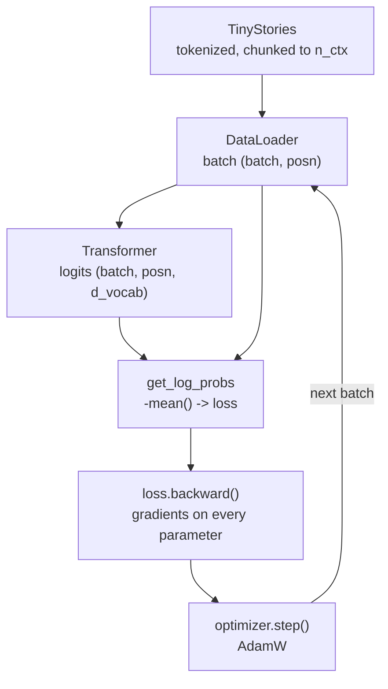
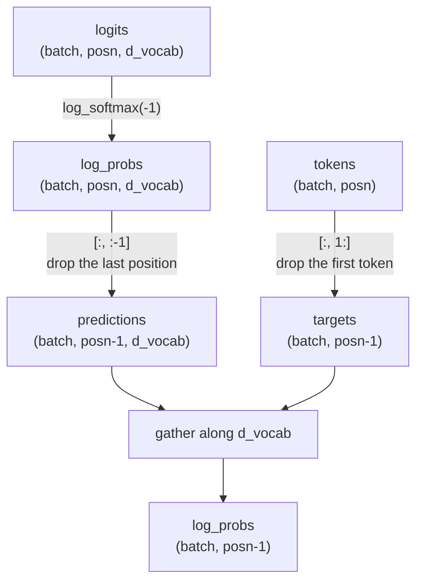
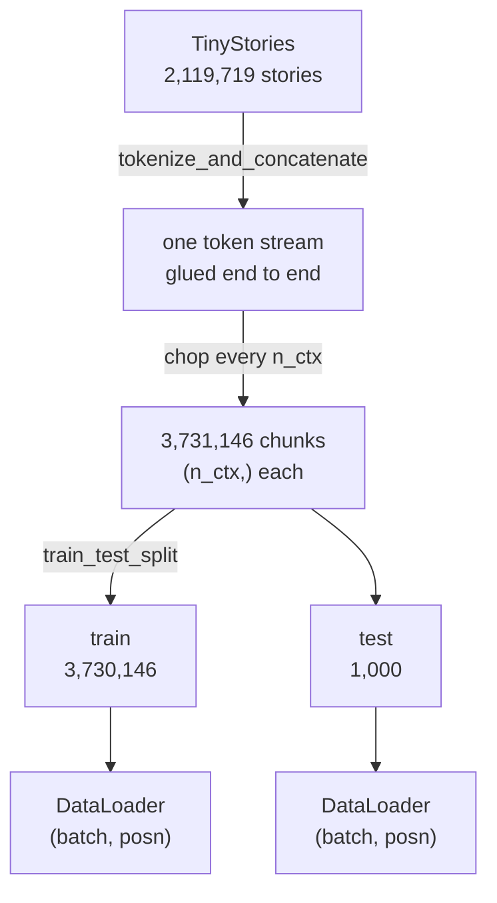
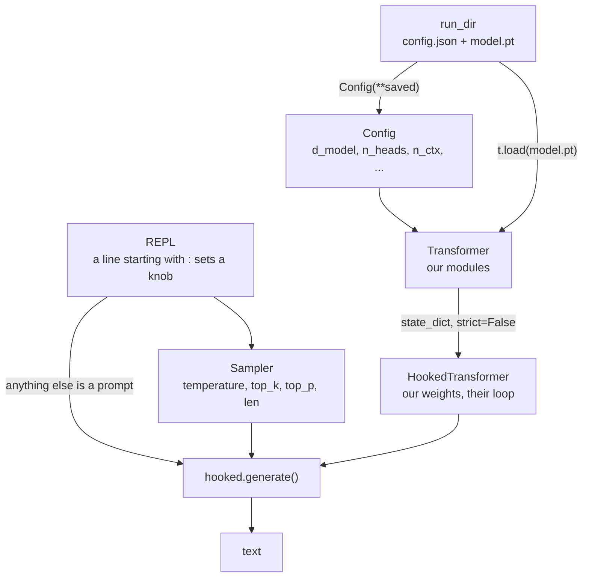

A continuation of [Understanding Transformers]({filename}understanding-transformers.md), where I ported ARENA's GPT-2 implementation into `PvML` one module at a time. To check each module I loaded GPT-2's own weights into it and compared the output against the reference, which is how I know the implementation is right.

But every weight in it was downloaded. Nothing had been learned.

This post is the other half: a loss, a dataset, and a training loop, then a model of my own trained on TinyStories.

PvML: https://github.com/d0mzw/PvML
Weights: https://huggingface.co/d0mzw/pvml-tinystories

Disclaimer: these notes come from working through the ARENA 3.0 curriculum. I claim no credit for the original material, and this is not affiliated with or endorsed by ARENA.

## The training loop



The model is the same one from the last post. Everything here is the machinery around it: where the batches come from, how a prediction is graded, and what moves the weights.


## Loss



How much probability the model gave to the token that actually came next, at every position.

### `get_log_probs`

```python
log_probs = logits.log_softmax(dim=-1)

return log_probs[:, :-1].gather(dim=-1, index=tokens[:, 1:].unsqueeze(-1)).squeeze(-1)
```

-  `logits` is `(batch, posn, d_vocab)`, a raw score for every token in the vocabulary at every position, which `log_softmax` turns into log-probabilities.
	- Our sentence `"The cat sat on the mat"` is 7 tokens because of the prepended BOS, so `(1, 7, 50257)`
	
- `log_probs[:, :-1]` drops the last position, which predicts a token that is not in the sequence, so there is no answer to grade it against. `(1, 7, 50257)` -> `(1, 6, 50257)`

```
position:   0      1      2      3      4      5      6
token:    <BOS>   The    cat    sat     on    the    mat
predicts:  The    cat    sat     on    the    mat     ?
                                                      └── nothing in the sequence to compare against
```

- `tokens` is `(batch, posn)`, the ids the text was tokenized into. Every token except `<BOS>` is also an answer: the one the position before it should have predicted.

- `tokens[:, 1:]` is the sequence shifted left by one, which is exactly that list of answers. `<BOS>` drops out because nothing predicts it. `(1, 7)` -> `(1, 6)`

- `.gather(dim=-1, index=...)` uses each answer token as an index into that position's 50257 scores, and returns the one it lands on. `(1, 6, 50257)` -> `(1, 6, 1)`
	- For example, at position 0 (`<BOS>`), shifting left by one gives the answer token `The`, and `gather` returns the log-probability `log_probs` assigned to `The` at that position.

- `.unsqueeze(-1)` adds an axis of length 1 on the end, `.squeeze(-1)` takes it away again: `(1, 6)` -> `(1, 6, 1)` going in, `(1, 6, 1)` -> `(1, 6)` coming out. They are only there because `gather` needs the index to have the same number of axes as the thing it indexes into. What is left is one log-probability per graded prediction.

### Module output

```bash
(.venv) dom@dom-z13:~/Desktop/PvML$ python -m pvml.training.losses
logits    (1, 7, 50257)
log_probs (1, 6)   # one per prediction, not per token

cross entropy, trained model : 4.578 nats
cross entropy, uniform guess : 10.825 nats
mean probability of the true next token: 0.114

per prediction
     <BOS> -> The      logprob  -3.278   p 0.0377
       The ->  cat     logprob  -9.222   p 0.0001
       cat ->  sat     logprob  -6.844   p 0.0011
       sat ->  on      logprob  -1.493   p 0.2248
        on ->  the     logprob  -0.870   p 0.4191
       the ->  mat     logprob  -5.761   p 0.0031
```

- 7 tokens give 6 predictions. The last position has no next token to be graded on
- `log(d_vocab) = 10.825` nats is what uniform guessing scores. GPT-2 gets 4.578 on this sentence, and the gap is what it knows
- Some predictions are nearly determined by context (`on -> the`, p 0.42), others not at all (`The -> cat`, p 0.0001). Average loss is always a mix of the two, which is why it never approaches zero

## Data



A training example is 128 contiguous tokens, not a story.

### `tinystories_loaders`

```python
tokenized = tokenize_and_concatenate(
    dataset, tokenizer, streaming=False,
    max_length=cfg.n_ctx, column_name="text",
    add_bos_token=True, num_proc=8,
)

split = tokenized.train_test_split(test_size=test_size, seed=seed)
```


- `train_test_split` shuffles first, so the held-out 1000 are not all from the tail of the corpus. `seed=` keeps the split the same across runs
- The loaders are returned rather than left as a module global, so the trainer takes its data as an argument

### Module output

```bash
(.venv) dom@dom-z13:~/Desktop/PvML$ python -m pvml.data.tinystories
train chunks : 3,730,146
test chunks  : 1,000
chunk length : 128 tokens
batch        : (4, 128)  keys=['tokens']

first chunk, decoded back to text:

<|endoftext|> park. One day, she saw a big white airplane in the sky. She pointed at it and said, "Look, Mommy! A pilot is flying that plane!"

Her mommy said, "Yes, Lily. Pilots fly airplanes."
```

- The chunk begins mid-sentence, on the tail of a story that is not in it. Chunks are cut from the stream, not from stories
- 3.7M chunks at batch size 32 is 116,000 steps for one full epoch, so training caps steps per epoch rather than running one to the end

## Trainer

The loop from the top of this post, with the pieces filled in.

### `TrainingArgs`

```python
batch_size: int = 32
epochs: int = 10
max_steps_per_epoch: int = 500
lr: float = 1e-3
weight_decay: float = 1e-2
```

- Separate from `Config`, which holds the architecture. These change between runs, those change between models
- An epoch is a full pass over the training set, but 3.7M chunks is 116,000 steps, so `max_steps_per_epoch` cuts it short

### `training_step`

```python
tokens = batch["tokens"].to(self.device)
loss = -get_log_probs(self.model(tokens), tokens).mean()
loss.backward()
self.optimizer.step()
self.optimizer.zero_grad()
```

- `-mean()` turns the `(batch, posn-1)` log-probabilities into one number to minimise
- `backward()` fills in a gradient on every parameter, `step()` applies it, `zero_grad()` clears it for the next batch

### `evaluate`

```python
predictions = self.model(tokens)[:, :-1].argmax(dim=-1)
correct += (predictions == tokens[:, 1:]).sum().item()
```

- The same `[:, :-1]` and `[1:]` offset as the loss, on the held-out chunks the model never trains on
- `argmax` instead of `gather`: how often the model's top pick was right, rather than what it scored the right answer

### Module output

```
{"step": 1, "loss": 10.83082389831543, "epoch": 0}
{"step": 2, "loss": 10.77728271484375, "epoch": 0}
...
{"step": 60, "loss": 7.720832824707031, "epoch": 1}
{"step": 60, "accuracy": 0.0453986220472441, "epoch": 1}
```

## Sampler



> **Update, 3 October 2026**  
> The generation loop has since been ported. See [Sampling from a Transformer]({filename}sampling-from-a-transformer.md). The rest of this section describes how it worked at the time of writing.

I have not ported the generation loop. `experiments/sample.py` loads the trained weights into a TransformerLens `HookedTransformer` and calls its `generate`.

- A run directory is self-contained: `config.json` rebuilds the architecture and `model.pt` fills it. Nothing else is needed to bring a finished run back
- `strict=False` because TransformerLens carries buffers we do not, the causal mask among them. The parameter names match, which is the part that matters
- The `Sampler` class holds nothing but the knobs and how they read back. It exists so the REPL can print the current settings and convert them to the arguments `generate` expects

### Options

| Command      | Effect                                                                                        |
| ------------ | --------------------------------------------------------------------------------------------- |
| `:temp 0.7`  | Divides the logits before the softmax. Below 1 sharpens the distribution, above 1 flattens it |
| `:greedy`    | Always take the most likely token. The same as temperature 0                                  |
| `:topk 40`   | Keep the 40 best tokens, discard the rest, renormalise                                        |
| `:topp 0.95` | Keep the smallest set of tokens whose probabilities sum to 0.95                               |
| `:len 60`    | How many tokens to generate                                                                   |
|              |                                                                                               |

- `top_k` and `top_p` are alternatives, not a pair. Setting one clears the other, because TransformerLens checks `top_k` first and it would silently win
- The defaults are temperature 0.7 with `top_p` 0.95, which is what every sample in this post used

### Module output

```bash
(.venv) dom@dom-z13:~/Desktop/PvML$ python experiments/sample.py runs/tinystories-d128-l6-h4-ctx512-40k

runs/tinystories-d128-l6-h4-ctx512-40k
  14,171,473 parameters, 6 layers, d_model 128
  temp 0.7, top_p 0.95, 50 tokens
  a prompt generates, :help for commands, :q to quit

pvml> Once upon a time
Once upon a time, there was a little girl named Lily. She loved to play in her
backyard, especially when she saw a big, scary monster! She was so scared that
she started to cry.

Her mom heard her cry and said, "Don

pvml> :greedy
  greedy, 50 tokens
pvml> Once upon a time
Once upon a time, there was a little girl named Lily. She loved to play outside
in the sunshine. One day, she went to the park to play with her friends. She saw
a big tree and decided to climb it.

As she climbed the

pvml> :temp 1.4
  temp 1.4, top_p 0.95, 50 tokens
pvml> Once upon a time
Once upon a time a painter who was the most courageous, dirty every painting
player had been wanting to take off the beautiful thin balloons home. The weary
square gained swiftly and carried, paying with daily thin brushes for his
reliable folder again to admire them whenever most happily grinding balloons
```


## Experiments

### Environment

| Component | Detail                                                 |
| --------- | ------------------------------------------------------ |
| Device  | ASUS ROG Flow Z13, Strix Halo (Ryzen AI MAX+ 395)      |
| OS      | Ubuntu 26.04.1 LTS, kernel 7.0.0-31-generic            |
| GPU     | Radeon 8060S integrated graphics, 128GB unified memory |
| PyTorch | 2.12.0a0+rocm7.13, ROCm nightly for gfx1151            |

### `TinyStories`

- https://huggingface.co/datasets/roneneldan/TinyStories

```
Dataset({ features: ['text'], num_rows: 2119719 })
```

- 2.1M stories written with the vocabulary of a three or four year old, generated by GPT-3.5 and GPT-4 for the paper *TinyStories: How Small Can Language Models Be and Still Speak Coherent English?*
- Simple enough for a model of a few million parameters to learn on one machine

Story length in GPT-2 tokens, on a 20,000 story sample:

| Mean | Median | p90 | p99 | Longest |
| --- | --- | --- | --- | --- |
| 222 | 191 | 358 | 641 | 1106 |

- The corpus is 478M tokens, 3,731,146 chunks at `n_ctx=128`
- 20,000 steps at batch 32 and `n_ctx` 128 is 81.9M tokens, 0.17 epochs. No run here is limited by running out of data

### Plan

| Run | Question |
| --- | --- |
| `tinystories-d32-l4-h16-ctx128-5k` | how far does the smallest model get |
| `tinystories-d128-l6-h4-ctx128-5k` | does more capacity help at the same steps |
| `tinystories-d256-l8-h8-ctx128-5k` | does capacity keep paying, or level off |
| `tinystories-d32-l4-h16-ctx128-20k` | is the small model limited by size or by training |
| `tinystories-d128-l6-h4-ctx128-20k` | does the medium model have a ceiling of its own |
| `tinystories-d128-l6-h4-ctx512-40k` | added later: was the wandering a context limit |

- Steps are held at 5,000 for the first three and 20,000 for the next two, so capacity and training length move one at a time
- `n_ctx` is 128 across those five. Context changes what a model can see, not just how big it is, so it gets its own run
- The sixth was not planned. It came out of reading the samples from the first five

### Results

The first five ran 22:50 to 01:35, the sixth 02:59 to 13:40 the next day.

| Run | n_ctx | Steps | Loss | Accuracy | Minutes | Last 500 steps |
| --- | --- | --- | --- | --- | --- | --- |
| `d128-l6-h4-ctx512-40k` | 512 | 40,000 | 1.732 | 0.573 | 641.3 | -0.002 |
| `d128-l6-h4-ctx128-20k` | 128 | 20,000 | 2.080 | 0.517 | 67.3 | -0.005 |
| `d128-l6-h4-ctx128-5k` | 128 | 5,000 | 2.369 | 0.476 | 17.0 | -0.036 |
| `d256-l8-h8-ctx128-5k` | 128 | 5,000 | 2.497 | 0.461 | 36.6 | -0.064 |
| `d32-l4-h16-ctx128-20k` | 128 | 20,000 | 2.782 | 0.421 | 34.6 | +0.006 |
| `d32-l4-h16-ctx128-5k` | 128 | 5,000 | 2.996 | 0.395 | 8.4 | -0.024 |

Only the five at `n_ctx` 128 are comparable with each other. Predicting a token from 511 tokens of context is an easier problem than from 127, so part of the top row's lead is the task, not the model. Re-chunking also changes the split, so the two windows were not evaluated on the same held-out text.

- Capacity beats steps. `d128` reaches 2.369 in 5,000 steps and 17 minutes. `d32` needs 20,000 steps and 35 minutes to reach only 2.782, so four times the steps and twice the clock still lands short
- `d32` uses 16 heads against `d128`'s 4, so its `d_head` is 2 where theirs is 32. The capacity comparison therefore mixes width with unusually narrow heads, and a rerun at `d32` with 4 heads would separate them
- Of the five, only `d32` at 20,000 steps has converged. Its last 500 steps went up 0.006, noise around a floor near 2.78. `d128` at 20,000 is still moving and `d256` was descending fastest of anything when it stopped
- `d256` losing to `d128` at 5,000 steps looks like undertraining rather than a ceiling, though nothing here rules the ceiling out. First epoch 5.404 against `d128`'s 4.343, then the steepest end slope of the five
- Every run uses a constant `lr=1e-3` with no warmup and no decay, inherited from the tiny model. Warmup plus cosine decay is the first thing to try on `d256` before concluding anything about its capacity
- `d256` at 20,000 steps is still unrun. The end slopes suggest it would overtake, which is a hypothesis and not a result

### What the best of these writes

The best and the worst of the five on the same two prompts. Temperature 0.7, `top_p` 0.95, seed 0, 60 new tokens. Each block holds only what the model wrote after the prompt above it.

`d128-l6-h4-ctx128-20k`, final loss 2.080.

Prompt `Once upon a time`:

```
there was a little girl called Sally. She loved her garden and always liked to
play in the garden. One day, Sally was playing in the garden when she heard a
loud noise.

Suddenly, the noise disturbed her. It was so loud that the girl couldn't see
her house. She
```

Prompt `Lily went to the park and saw`:

```
a big tree. She wanted to climb it, but her mom said no. She said, "You can't
climb the tree, Lily. It is not safe. It is not safe. You can fall from the
tree."

Lily was sad, but she did not want to climb
```

`d32-l4-h16-ctx128-20k`, final loss 2.782, same prompts and settings.

Prompt `Once upon a time`:

```
there was a little girl named Sally. One day, Sally went to the park to play.
She saw a big tree. She wanted to play outside. So, she asked her mommy for
help. Her mommy said yes.

Suddenly, the squirrel started to run and higher.
```

Prompt `Lily went to the park and saw`:

```
a big, orange bear. She was so happy and looked around the tree. She said, "I
like the bear. I found a pear. I like it." She said, "Yes, I want to play with
it. Can I help you?"

She ran to the ball and
```

- Both are fluent and both hold one name throughout, so neither is the difference
- `d32` introduces things nothing set up: a squirrel, a pear, a ball. `d128` keeps referring to what it already named
- `d128` holds a short causal chain: mom refuses, Lily is sad. `d32` has Lily answer `"Yes,"` to a question nobody asked
- `d128` still repeats. `It is not safe` twice within four words
- The samples stop mid-sentence because the cap is 60 tokens, not because the model ran out

### Plots

```bash
python experiments/plot.py
```

Reads every run with a `summary.json`. Runs are grouped by window, so the four charts below hold only the five at `n_ctx` 128.

Who plateaued and who was still descending when it stopped.


The same runs priced in minutes rather than steps.


Final loss against non-embedding parameters.


Next-token accuracy per epoch.


- Per-step loss is too noisy to read, so it is averaged into 100-step windows
- Only non-embedding parameters are plotted. The vocabulary tables dominate these models and do not change with depth or width, so including them would stack every run in the same place
- Loss against wall clock is the chart that changes a decision. Per step a bigger model always looks better, per minute it sometimes does not

## A longer window

The five runs above all used `n_ctx=128`, and every one of them wrote stories that wandered. The obvious suspect was capacity. It was not.

### Why 128 was the wrong number

How much of a story each window holds, against a median of 191 tokens:

| n_ctx | Stories that fit whole |
| --- | --- |
| 128 | 5.2% |
| 512 | 96.8% |
| 1024 | 99.9% |

- `tokenize_and_concatenate` glues the corpus into one stream and chops it into `n_ctx` chunks, so a chunk starts and ends wherever it lands. At 128 tokens that is almost always mid-story
- Endings were never the missing piece. Chunks land across story boundaries at a rate of roughly 0.58 per chunk, so the earlier models read endings constantly. What they never saw was one whole arc, start to finish, inside a single window
- 512 is chosen on coverage, not on cost. It holds 96.8% of stories whole and 1024 adds three points. Measured at equal tokens per step, doubling to 1024 costs 1.28x, which would have been affordable

### The run

```
tinystories-d128-l6-h4-ctx512-40k
```

- Same model as the best ctx128 run: `d_model` 128, 6 layers, 4 heads. Same `batch_size` 32, `lr` 1e-3, `seed` 0
- 40,000 steps at this window is 655M tokens, 1.37 epochs of the corpus and 8x the token budget of the best ctx128 run
- `max_steps_per_epoch` moved from 500 to 1000, which halves the number of evals for the same total. It changes how often training pauses, not what the model sees

It reached 1.732 and 0.573, against 2.080 and 0.517 for the same model at `n_ctx` 128. For the reason given above, that gap is not all model, so the samples are the evidence that counts.


### What changed

Temperature 0.7, `top_p` 0.95, seed 0, and a 250 token cap it does not reach.

Prompt `Once upon a time`:

```
there was a little girl called Sally. She loved to explore and try new
things.

One day Sally went to a big, modern building. She was so excited! Inside the
building, she found a box. Inside, there were lots of toys, but Sally was so
excited. She could not wait to play with them.

Sally was so happy. She could not believe it! She had so many new toys to
play with. Sally was so excited that she couldn't wait to play with them
again!

The next day, Sally took her new toys to the museum and had lots of fun. She
found lots of new things to play with. She was so happy that she had a great
time!
```

Prompt `Lily went to the park and saw`:

```
a big tree. She wanted to climb it and see what was on the other side. She
climbed and climbed and reached the top. She was very happy and excited. She
saw the whole park and saw the flowers and the birds. She saw a butterfly and
the birds and the squirrels. She felt very happy and proud. She felt very
special and loved. She thanked the squirrel and said thank you. The squirrel
smiled and said thank you. Lily was glad she could go to the park and see more
things. She felt very happy and proud.
```

- It stops on its own after 150 tokens. Raising the cap from 250 to 400 changes nothing
- It has a shape: a setup, a next day, a close. At `n_ctx` 128 the model only ever saw slices of a story, never a whole one
- Repetition got worse. `so excited` three times, `wait to play with them` twice
- Reference drifts. The `modern building` becomes `the museum`, and Lily thanks a squirrel that was only an item in a list of things she saw

Across five seeds per prompt at the same settings, seven of the ten stories reached end-of-text on their own and three ran to the 250 token cap. The three that hit the cap are the three that fell into a repetition loop, `I love you` and `She wished she had` repeating until the cap stopped them. So the window bought story structure, and repetition is what still breaks it. Coherence within a story is uneven rather than absent: `Timmy` fixing a picture with glue holds together, while a bear carries candy out of a tree that was never mentioned.

### Cost

- 10.7 hours on the Z13, against 67 minutes for the ctx128 run of the same model
- 0.962 sec/step against 0.202, both measured end to end on the real runs. That is 4.8x for 4x the tokens per step
- Profiling the forward pass at batch 32 puts most of the time in the unembedding, not attention. At `n_ctx` 128 it is 28.0ms of 37.0ms, 75.7%. At 512 it is 108.8ms of 199.4ms, 54.6%. Projecting `d_model` 128 up to 50,257 logits at every position is a larger matmul than anything in the blocks
- The blocks are what make the cost superlinear. Going 128 to 512 is 4x the tokens, and they take 10.1x the time while the unembedding takes 3.9x. So attention's quadratic term explains the excess over 4x, while the unembedding explains the bulk of the absolute cost
- The `n_ctx=512` chunking is not the same dataset as `n_ctx=128`, so the corpus is tokenized again. That is a one-time pass and 4GB of cache
