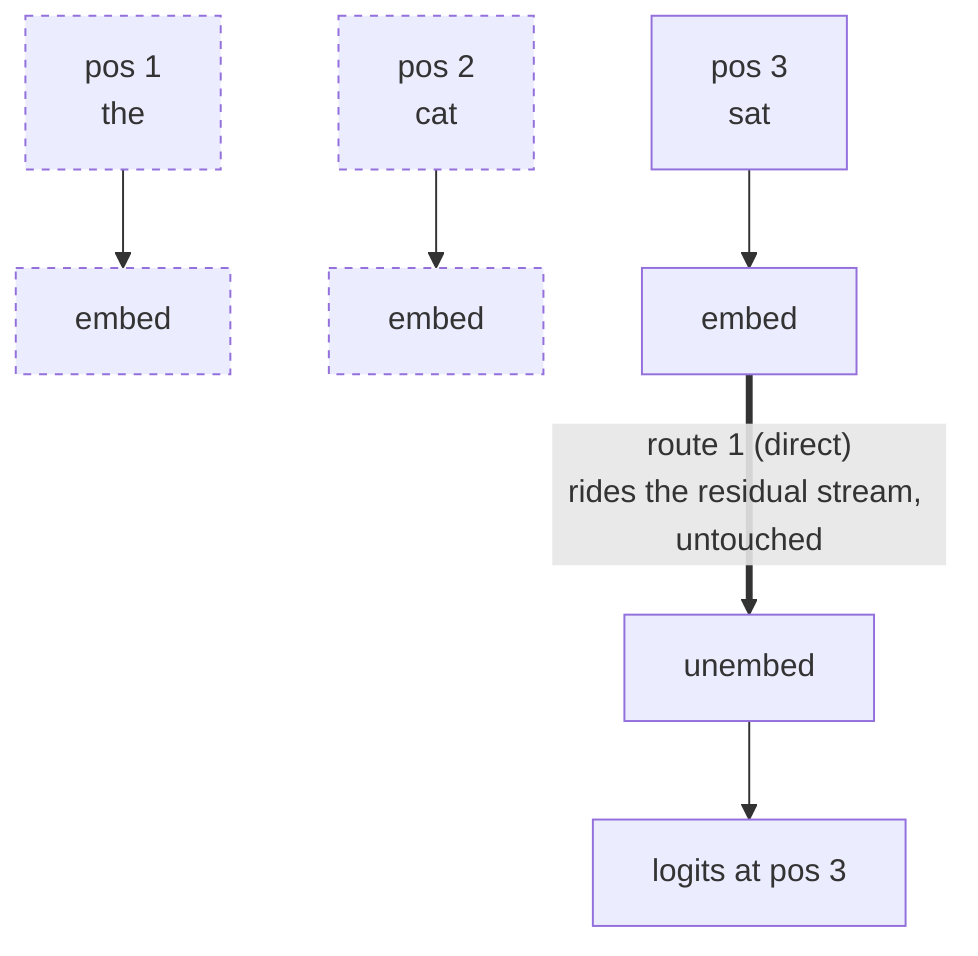
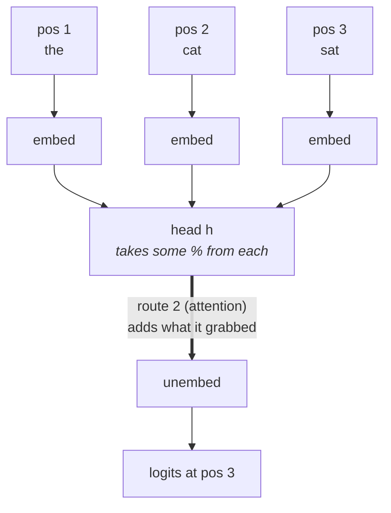

The groundwork for [A Mathematical Framework for Transformer Circuits](https://transformer-circuits.pub/2021/framework/index.html): what a one-layer attention-only model actually computes, worked through end to end. Architecture background in [Understanding Transformers]({filename}understanding-transformers.md).

## Path decomposition of transformer output

### Two routes

One-layer attention-only transformer. Tokens in, logits out at each position. One sequence runs through the whole note:

| pos   | 1     | 2     | 3     | 4    | 5     | 6     | 7   | 8     | 9     |
| ----- | ----- | ----- | ----- | ---- | ----- | ----- | --- | ----- | ----- |
| token | `the` | `cat` | `sat` | `on` | `the` | `mat` | `.` | `the` | `cat` |

Two routes run from a token to a logit. Both are below, over the first three positions. The next two sections take one each:

```
          pos 1       pos 2       pos 3
token:    "the"       "cat"       "sat"
            |           |           |
          embed       embed       embed
            |           |           |
            |           |           '---------------.
            |           |                           |
            |           |      route 1 (direct):    |
            |           |      rides the residual   |
            |           |      stream, untouched    |
            |           |                           |
            '-----------+-----> head h -------------+
                                                    |
              route 2 (attention):                  |
              the head reads back over              |
              earlier positions, taking             |
              some % from each, and adds            |
              what it grabbed                       |
                                                    v
                                                 unembed
                                                    |
                                                    v
                                            logits at pos 3
```

Position 3 can read positions 1, 2 and 3, never forward. That restriction is the **causal mask**.

Three simplifications throughout: no MLPs, LayerNorm folded into adjacent weights, and no positional embeddings.

### Route 1: the token's own embedding


*Dashed = present in the sequence, unused by this route.*

`"sat"` is embedded, rides the residual stream, hits the unembed untouched. Alone that makes a **bigram table**: a lookup keyed on one previous token.

|           | `the` | `cat` | `sat` | `on` | `mat` | `.` |
| --------- | ----- | ----- | ----- | ---- | ----- | --- |
| **`the`** | 0.0   | 3.7   | 0.2   | 0.1  | 4.1   | 0.0 |
| **`cat`** | 0.3   | 0.0   | 3.9   | 0.4  | 0.1   | 1.2 |
| **`sat`** | 1.1   | 0.1   | 0.0   | 4.2  | 0.2   | 0.9 |
| **`on`**  | 4.4   | 0.2   | 0.0   | 0.0  | 0.6   | 0.1 |
| **`mat`** | 0.5   | 0.1   | 0.1   | 0.2  | 0.0   | 3.8 |
| **`.`**   | 3.5   | 0.2   | 0.0   | 0.1  | 0.1   | 0.0 |

*Row = the token you just saw, column = a candidate next token, cell = score. Six tokens here; the real table is `n_vocab x n_vocab`.*

Walk the first three positions through it:

- **`"the"`** -> read row `the` -> `mat` 4.1 beats `cat` 3.7. Predicts `mat`. Our sequence has `cat`, so this one is wrong.
- **`"the cat"`** -> read row `cat` -> `sat` scores 3.9. Predicts `sat`. Correct.
- **`"the cat sat"`** -> read row `sat` -> `on` scores 4.2. Predicts `on`. Correct.

The last step read row `sat` and nothing else. There is no row for `"the cat sat"`, so `"the cat"` is gone. By position 3 the model remembers only the token under it.

Reaching back for what it forgot is route 2's job.

### Route 2: what the head reaches back for



The head reads back over earlier positions, takes a percentage of each, and adds what it grabbed to the residual stream, which carries it to the unembed.

Stand at position 8, on the third `the`. Route 1 reads row `the` and answers `mat` over `cat`, the same mistake as position 1. It cannot know this sentence is about a cat.

Route 2 takes two steps: **pick where to look**, then **use what is there**.

**Step 1: where to look.** Every position scores every position it may see. A score is how well a source matches what the destination wants. With no positional embeddings a position carries nothing but its token, so a score depends only on the two tokens involved, the one you are standing on and the one you are looking at. `x` marks a cell the **causal mask** blocks:

| to \ from   | 1 `the` | 2 `cat` | 3 `sat` | 4 `on`  | 5 `the` | 6 `mat` | 7 `.`   | 8 `the` | 9 `cat` |
| ----------- | ------- | ------- | ------- | ------- | ------- | ------- | ------- | ------- | ------- |
| 1 `the`     | 0.4     | x       | x       | x       | x       | x       | x       | x       | x       |
| 2 `cat`     | 0.5     | 0.3     | x       | x       | x       | x       | x       | x       | x       |
| 3 `sat`     | 0.6     | 1.2     | 0.3     | x       | x       | x       | x       | x       | x       |
| 4 `on`      | 0.7     | 1.0     | 0.5     | 0.3     | x       | x       | x       | x       | x       |
| 5 `the`     | 0.4     | 3.4     | 0.7     | 0.6     | 0.4     | x       | x       | x       | x       |
| 6 `mat`     | 0.5     | 0.9     | 0.4     | 0.6     | 0.5     | 0.3     | x       | x       | x       |
| 7 `.`       | 0.4     | 0.8     | 0.5     | 0.4     | 0.4     | 0.9     | 0.3     | x       | x       |
| **8 `the`** | **0.4** | **3.4** | **0.7** | **0.6** | **0.4** | **2.3** | **0.5** | **0.4** | **x**   |
| 9 `cat`     | 0.5     | 0.3     | 0.6     | 0.4     | 0.5     | 0.8     | 0.3     | 0.5     | 0.3     |

*Row = where you are standing, column = where you are looking, cell = the score.*

Lower triangular: the causal mask drawn out. Rows 5 and 8 are both `the` and both score `cat` highest, because a `the` wants a noun. Row 1 is a `the` with nothing behind it.

Row 8 is ours. Its `x` in column 9 hides `cat`, the token position 8 must predict. Unmasked it reads 3.4, takes most of the attention, and the model copies the answer instead of inferring it.

Now take row 8 out of the matrix:

```
  0.4   3.4   0.7   0.6   0.4   2.3   0.5   0.4    x
```

These go into softmax. Real attention divides by $\sqrt{d_\text{head}}$ first, which changes the numbers but not the shape. Exponentiate each, divide by the total:

| pos | token | score   | exp      | attention         |
| --- | ----- | ------- | -------- | ----------------- |
| 1   | `the` | 0.4     | 1.5      | 1.5 / 50 = 3%     |
| 2   | `cat` | **3.4** | **30.0** | 30 / 50 = **60%** |
| 3   | `sat` | 0.7     | 2.0      | 2.0 / 50 = 4%     |
| 4   | `on`  | 0.6     | 1.8      | 1.8 / 50 = 4%     |
| 5   | `the` | 0.4     | 1.5      | 1.5 / 50 = 3%     |
| 6   | `mat` | **2.3** | **10.0** | 10 / 50 = **20%** |
| 7   | `.`   | 0.5     | 1.7      | 1.7 / 50 = 3%     |
| 8   | `the` | 0.4     | 1.5      | 1.5 / 50 = 3%     |
| 9   | `cat` | x       | **0.0**  | 0 / 50 = **0%**   |
|     |       |         | **50.0** | **100%**          |

Exponentiating decides it:

- **`cat` at position 2** -> scores 3.4 -> `exp` 30.0 -> 30.0 / 50.0 = **60%**
- **`mat` at position 6** -> scores 2.3 -> `exp` 10.0 -> 10.0 / 50.0 = **20%**
- **position 9** -> masked -> `exp` 0.0 -> **0%**

A gap of $3.4 - 2.3 = 1.1$ in score becomes a factor of $30.0 / 10.0 = 3$ in attention. That is what exponentiating does, and it is why `cat` ends up holding most of the head.

This row is row 8 of the head's attention pattern, written $A$ here and $A^h$ once there is more than one head.

**Step 2: what it does.** Route 2's own lookup table, same shape as the bigram one, keyed on the position attended to rather than the token under you:

|         | `the`   | `cat`   | `sat`   | `on`    | `mat`   | `.`     |
| ------- | ------- | ------- | ------- | ------- | ------- | ------- |
| 1 `the` | **0.9** | 0.1     | 0.0     | 0.1     | 0.1     | 0.0     |
| 2 `cat` | 0.1     | **5.0** | 0.2     | 0.0     | 0.0     | 0.0     |
| 3 `sat` | 0.2     | 0.1     | **4.1** | 0.1     | 0.1     | 0.0     |
| 4 `on`  | 0.1     | 0.0     | 0.1     | **3.4** | 0.2     | 0.0     |
| 5 `the` | **0.9** | 0.1     | 0.0     | 0.1     | 0.1     | 0.0     |
| 6 `mat` | 0.1     | 0.2     | 0.1     | 0.0     | **2.0** | 0.1     |
| 7 `.`   | 0.0     | 0.1     | 0.0     | 0.0     | 0.0     | **1.8** |
| 8 `the` | **0.9** | 0.1     | 0.0     | 0.1     | 0.1     | 0.0     |
| 9 `cat` | 0.1     | **5.0** | 0.2     | 0.0     | 0.0     | 0.0     |

*Row = a position, column = a candidate next token, cell = how much attending there shifts the logit.*

A row depends only on the token at that position, so 1, 5 and 8 are identical, as are 2 and 9. Position 9 has a row like any other; step 1 gave it 0%. The big diagonal is the tell: attend to `cat`, boost `cat`. A **copying head**.

Multiply step 1 by step 2:

- **position 2** -> 60% attention, row `2 cat`, `cat` scores 5.0 -> 0.60 x 5.0 = **+3.0 to `cat`**
- **position 6** -> 20% attention, row `6 mat`, `mat` scores 2.0 -> 0.20 x 2.0 = **+0.4 to `mat`**
- **everything else** -> 3 to 4% each, on rows that boost `the`, `sat`, `on` and `.` -> under 0.1 to either candidate, so the ranking is untouched

Add the routes:

```
            route 1   route 2    total
  "mat"       4.1       +0.4       4.5
  "cat"       3.7       +3.0       6.7   <- wins
```

Route 1 answered from the token under it and got `mat` again. Route 2 reached six positions back, found `cat`, and flipped the prediction. That shape is a **skip-trigram**: *X is in the context, so predict X*. A bigram table cannot do it, and it is what one-layer heads mostly learn. Copying names is the classic case: `Mr Dursley ... Mr ___` -> `Dursley`.

Two routes, added:

```
logits at a position  =  route 1  +  one term per attention head
```

### The trick

Those percentages are the **only nonlinear part** of the model. Everything else is matrix multiplication.

Pretend they are fixed constants. The path from input token to output logit becomes a chain of matrix multiplies, and a chain of matrices collapses into **one**.

That matrix is what you want: vocab in, vocab out, read straight off the weights without running the model. Route 1 gives one, each head another. The formula is the list.

### The formula

$$T = \text{Id} \otimes W_U W_E + \sum_{h \in H} A^h \otimes (W_U W_{OV}^h W_E)$$

Every symbol in the formula maps to something from the worked example:

| Symbol                           | Shape                | What it is                                                  |
| -------------------------------- | -------------------- | ---------------------------------------------------------- |
| $T$                              |                      | the whole model: tokens in, logits out                      |
| $W_E$                            | `[d_model, n_vocab]` | embed                                                       |
| $W_U$                            | `[n_vocab, d_model]` | unembed                                                     |
| $\text{Id} \otimes W_U W_E$      |                      | **route 1**                                                 |
| $W_U W_E$                        | `[n_vocab, n_vocab]` | route 1's **bigram table**                                  |
| $\text{Id}$                      | `[n_ctx, n_ctx]`     | "read this position only": route 1 never moves positions   |
| $\sum_{h \in H} \dots$           |                      | **one term per head**; they just add                       |
| $W_{QK}^h = W_Q^{hT} W_K^h$      | `[d_model, d_model]` | the head's query-key map                                    |
| $W_E^T W_{QK}^h W_E$             | `[n_vocab, n_vocab]` | route 2 **step 1**: the score table                         |
| $A^h$                            | `[n_ctx, n_ctx]`     | those scores softmaxed: the percentages, carrying the mask  |
| $W_{OV}^h = W_O^h W_V^h$         | `[d_model, d_model]` | the head's value-output map                                 |
| $W_U W_{OV}^h W_E$               | `[n_vocab, n_vocab]` | route 2 **step 2**: the lookup table                        |
| $\otimes$                        |                      | glues the *which position* part onto the *what it does* part |

Each term splits the same way: **a left factor saying which positions**, and **a right factor saying what happens to the logits**.

Note what is missing: $W_Q$ and $W_K$. The formula takes $A^h$ as given, so the weights behind it are already absorbed. That is the freeze, visible in the notation.

### The tensor-product notation

$A \otimes B$ is a factored linear map. With input $t$, a `[n_ctx, n_vocab]` matrix of one-hot rows, $(A \otimes B) \cdot t = A t B^T$. The factors act on different axes:

- **left** ($\text{Id}$, $A^h$) acts across *positions*: which source reaches which destination
- **right** ($W_U W_E$, $W_U W_{OV}^h W_E$) acts across the *vocabulary*: what that does to the logits

Neither knows about the other. That separation is the point.

### The attention pattern $A$

Softmax every row of the step 1 matrix, not just row 8, and you get $A$. Same grid, same `x`, scores as percentages.

| to \ from   | 1 `the` | 2 `cat` | 3 `sat` | 4 `on` | 5 `the` | 6 `mat` | 7 `.` | 8 `the` | 9 `cat` |
| ----------- | ------- | ------- | ------- | ------ | ------- | ------- | ----- | ------- | ------- |
| 1 `the`     | 100%    | x      | x      | x      | x      | x      | x      | x      | x      |
| 2 `cat`     | 55%     | 45%     | x      | x      | x      | x      | x      | x      | x      |
| 3 `sat`     | 28%     | 51%     | 21%     | x      | x      | x      | x      | x      | x      |
| 4 `on`      | 26%     | 36%     | 21%     | 17%    | x      | x      | x      | x      | x      |
| 5 `the`     | 4%      | **82%** | 5%      | 5%     | 4%      | x      | x      | x      | x      |
| 6 `mat`     | 16%     | 24%     | 14%     | 17%    | 16%     | 13%     | x      | x      | x      |
| 7 `.`       | 12%     | 18%     | 14%     | 12%    | 12%     | 21%     | 11%   | x      | x      |
| **8 `the`** | 3%      | **60%** | 4%      | 4%     | 3%      | 20%     | 3%    | 3%      | x      |
| 9 `cat`     | 11%     | 9%      | 13%     | 10%    | 11%     | 17%     | 9%    | 11%     | 9%      |

- **In $A[i,j]$, $i$ is where you're standing and $j$ is where you're looking.** $A[8,2] = 60\%$ is position 8 on `the` looking back at position 2 on `cat`. Swap them and $A[2,8]$ is `x`: position 2 cannot see the future.
- **Rows sum to 100%, columns do not.** Each destination splits a fixed budget; a source can be read by many or none. Row 1 is 100% on itself, having nowhere else to look.
- **Read down a column** for the other question. Who attends to `cat` at position 2? Rows 5 and 8, at 82% and 60%, both of them a `the`.
- **Row 5 gets 82% where row 8 gets 60%**, same token asking the same question. Position 5 cannot see `mat` yet, so `cat` has no competition; by position 8 it does.
- **The shape of the rows names the head.** A diagonal band is a previous-token head. A row that puts almost all of its percentage on position 1 means the head is parked there, reading the first token and doing nothing useful. That is how a head switches itself off.

One $A$ per head, hence $A^h$.

### The two terms, formally

$$\text{Id} \otimes W_U W_E$$

Route 1. A zero-layer transformer has only this term, and training drives $W_U W_E$ to approximate bigram log-likelihoods.

$$\sum_{h \in H} A^h \otimes (W_U W_{OV}^h W_E)$$

Route 2. Heads don't interact in a one-layer model, which is why the terms simply add. Each factors into the two steps:

- **$W_E^T W_{QK}^h W_E$, the QK circuit.** Step 1, where to look. Entry $(a, b)$ is how much a destination holding token $a$ wants a source holding token $b$. Step 1's matrix is this table read off at the sequence's tokens, which is why its scores depended only on the two tokens involved. Softmax them over the context and you get $A^h$, which is the circuit's output, not the circuit itself.
- **$W_U W_{OV}^h W_E$, the OV circuit.** Step 2, what it does. Independent of position *and* of the attention pattern.

Both are `[n_vocab, n_vocab]`, and together they are the head.

One thing the worked example skipped: the head carries a **value vector**, not the token.

Each source $j$ computes $v_j = W_V \cdot (\text{residual stream at } j)$. The head outputs the attention-weighted sum, and $W_O$ maps it back into the residual stream. $W_V$ is a projection, so only the subspace that head cares about travels. Every attended position lands at once: a blend, not a choice.

$W_{OV}^h = W_O^h W_V^h$ is that round trip. It is `[d_model, d_model]` but has rank at most `d_head`, factoring through the head's narrow dimension. Sandwich it between $W_E$ and $W_U$ for the vocab-to-vocab lookup table.

### Why this framing is useful

All of this holds only with $A^h$ frozen. Given that, the decomposition is exact: behaviour reads straight off the weights as a sum of paths.

The payoff: a head is interpretable from its QK and OV matrices alone, both `[n_vocab, n_vocab]`, never by probing activations. Read them directly, or eigendecompose the OV matrix, where positive eigenvalues mark a head that copies whatever it attends to. The paper's skip-trigram example is `[perfect] ... [are] -> [perfect]`.

It also sets up the two-layer story. Everything above is a single attention block. Stack a second one on top and its input is the first block's output rather than the raw embeddings, so its $A^h$ is no longer a function of the tokens alone. The cross terms that creates, where the second block's queries, keys or values read what the first block wrote (Q-, K- and V-composition), are where induction heads come from.
