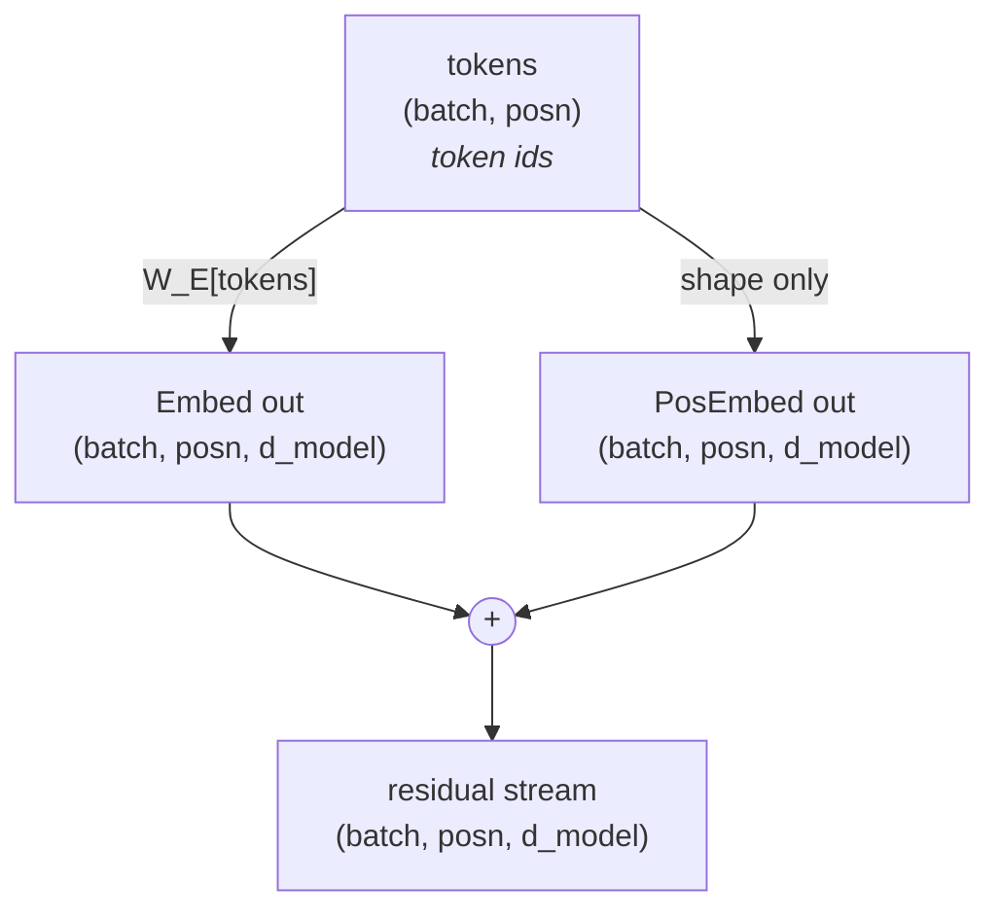
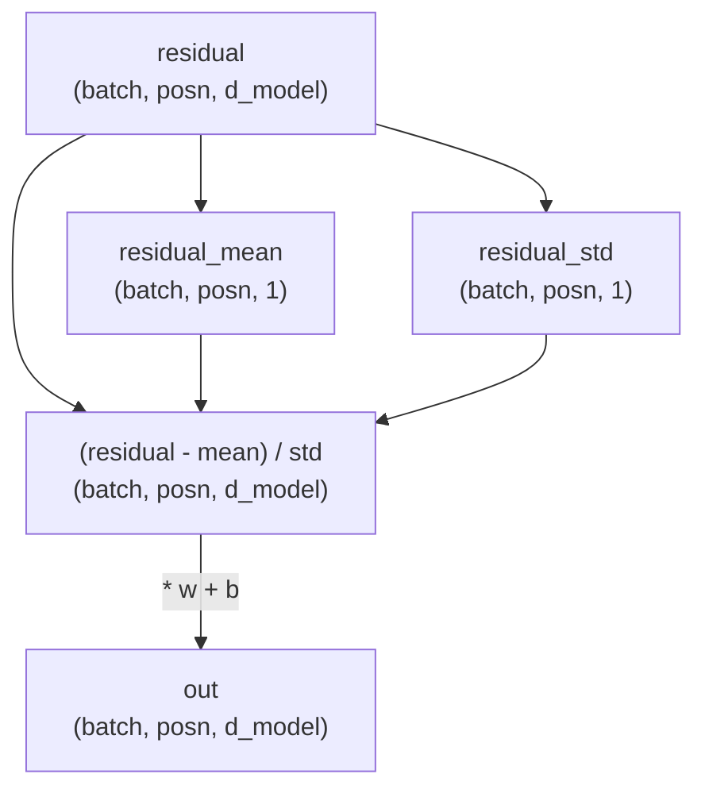
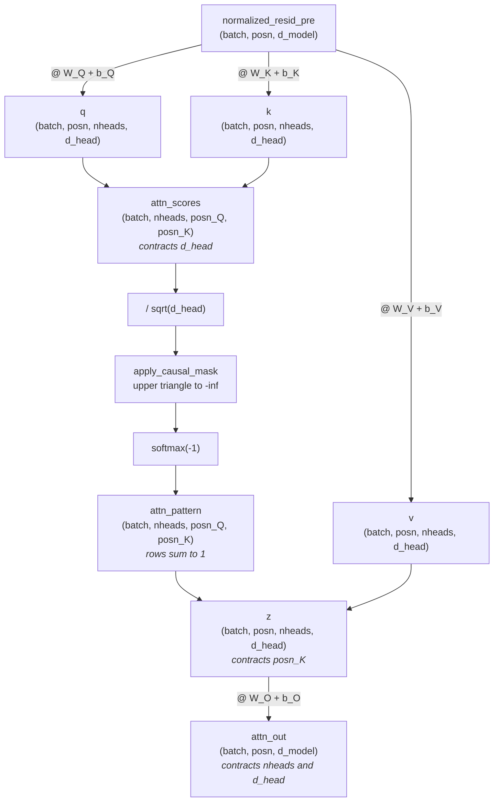
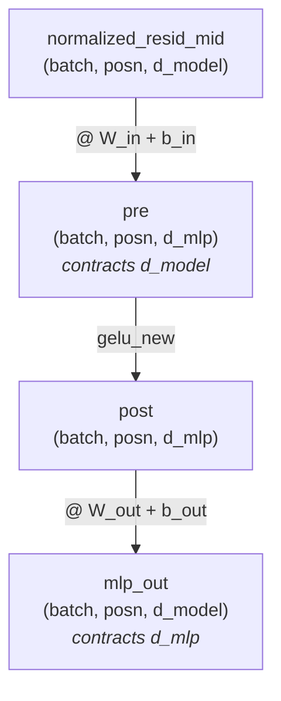
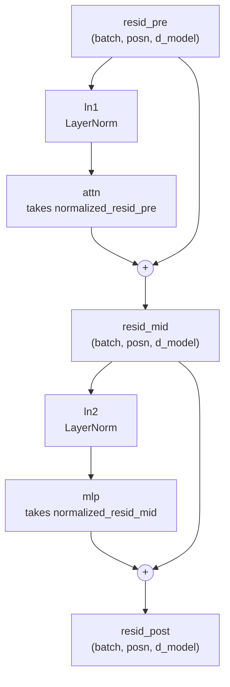
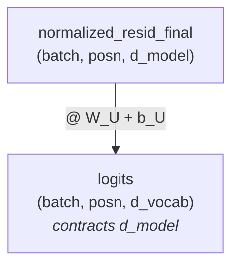
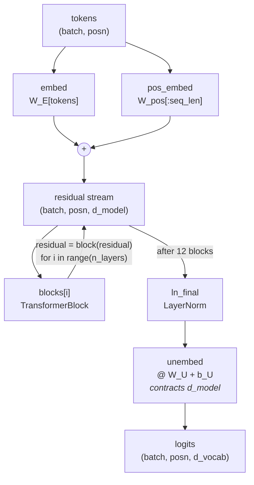

I've been self-studying ARENA, an AI-safety curriculum whose first chapter has you rebuild GPT-2 from scratch. Transformers were the gap I kept hitting. They're the core of every LLM, and the interpretability side I actually care about is hard to follow without understanding what sits underneath it.

So I ported the whole chapter into my own modular implementation, checking each module against real GPT-2 weights as I went. The attention layer reproduces the reference output exactly, bit for bit. These are my notes from doing that, module by module, with the shapes and diagrams I needed to follow it. I also built a drill program to get fluent in einops, once reading the tensor code stopped being enough.

PvML: LINK · einops-gym: LINK

Disclaimer: these notes come from working through the ARENA 3.0 curriculum. I claim no credit for the original material, and this is not affiliated with or endorsed by ARENA.

## Embedding module



Integers become vectors here, and the two results are added to form the residual stream that every later layer reads from and writes back into.

### `Embed`

One lookup, no matrix multiply: each token id is replaced by its row of `W_E`.

```python
self.W_E = nn.Parameter(t.empty((cfg.d_vocab, cfg.d_model)))

out = self.W_E[tokens]
```

```
(d_vocab, d_model)[(batch, posn)]  ->  (batch, posn, d_model)
 50257    768       1      7            1      7     768
```

- Indexing a 2-D table with a 2-D index tensor gives 3-D: the index shape is kept and the row axis is appended
- `W_E` is 50257 x 768 = 38.6M parameters, about 30% of GPT-2 small

### `PosEmbed`

Only the shape of `tokens` is read. Position embeddings encode where a token sits, not which token it is.

```python
self.W_pos = nn.Parameter(t.empty((cfg.n_ctx, cfg.d_model)))

batch, seq_len = tokens.shape
sliced = self.W_pos[:seq_len]
out = einops.repeat(sliced, "seq d_model -> batch seq d_model", batch=batch)
```

- `W_pos` always has `n_ctx` rows, so it is sliced to the sequence length
- `repeat` copies the same table for every sequence in the batch: position 3 means the same thing everywhere
- `n_ctx = 1024` is a hard ceiling, not a setting. There is no row 1025, so GPT-2 cannot attend past 1024 positions

### Module output

```bash
(.venv) dom@dom-z13:~/Desktop/PvML$ python -m pvml.modules.embedding
text='The cat sat on the mat'
ref.to_str_tokens(text)=['<|endoftext|>', 'The', ' cat', ' sat', ' on', ' the', ' mat']
tokens.shape=torch.Size([1, 7])

[embed]                       in: (1, 7)          # token ids, not activations
[embed]                      W_E: (50257, 768)    # one row per vocab entry
[embed]                      out: (1, 7, 768)
[pos_embed]                   in: (1, 7)          # values ignored, only the shape is read
[pos_embed]                W_pos: (1024, 768)     # one row per position, up to n_ctx
[pos_embed]               sliced: (7, 768)        # W_pos[:seq_len]
[pos_embed]                  out: (1, 7, 768)     # same table repeated for each sequence
```

- `d_vocab = 50257` is 256 byte tokens + 50,000 BPE merges + `<|endoftext|>`
- The tokenizer prepends `<|endoftext|>` as BOS, and leading spaces belong to the token: `' cat'` and `'cat'` are different ids

## LayerNorm



Standardise each position's vector on its own, then apply a learned scale and shift. Attention never normalises its own input; the block runs this first and passes the result in as `normalized_resid_pre`.

### Statistics

```python
residual_mean = residual.mean(dim=-1, keepdim=True)
residual_std = (residual.var(dim=-1, keepdim=True, unbiased=False) + self.cfg.layer_norm_eps).sqrt()
```

- Reduced along `d_model` only, so every `(batch, posn)` vector is normalised by its own 768 numbers. Nothing is shared across positions or across the batch
- `keepdim=True` leaves the reduced axis as size 1 so it broadcasts back: `(2, 10, 768) - (2, 10, 1)` works, `(2, 10, 768) - (2, 10)` does not
- `unbiased=False` divides by N, not N-1. These 768 numbers are the whole population, and it is what GPT-2 was trained with, so parity depends on it
- `layer_norm_eps` is added to the variance, inside the sqrt

### Scale and shift

```python
self.w = nn.Parameter(t.ones(cfg.d_model))
self.b = nn.Parameter(t.zeros(cfg.d_model))

residual = (residual - residual_mean) / residual_std
out = residual * self.w + self.b
```

- `w` and `b` start at ones and zeros, so the layer begins as pure standardisation and learns whether to deviate
- They are `(d_model,)`, shared across every position, while the mean and std are per position. Normalise locally, transform globally
- Broadcasting pads the missing leading axes: `(2, 10, 768) * (768,)` becomes `(1, 1, 768)` then stretches
- Magnitude is discarded: `[1, 2, 3, 4]` and `[10, 20, 30, 40]` come out identical

### Module output

```bash
(.venv) dom@dom-z13:~/Desktop/PvML$ python -m pvml.modules.normalization
[ln]                    residual: (2, 10, 768)    # as it arrives
[ln]               residual_mean: (2, 10, 1)
[ln]                residual_std: (2, 10, 1)
[ln]                    residual: (2, 10, 768)    # reassigned: (residual - mean) / std
[ln]                        w, b: (768,)          # padded to (1, 1, d_model), stretched to out
[ln]                         out: (2, 10, 768)    # * w + b
```

## Attention module



Each position asks what it needs (`q`), every earlier position advertises what it has (`k`), and the match decides how much of their content (`v`) gets copied back. Attention is the only place information moves between positions.

### `q, k, v`

All three use the same `einsum` string, the same shape, and the same broadcast.

```python
q = einsum(resid, self.W_Q, "batch posn d_model, nheads d_model d_head -> batch posn nheads d_head") + self.b_Q

k = einsum(resid, self.W_K, "batch posn d_model, nheads d_model d_head -> batch posn nheads d_head") + self.b_K

v = einsum(resid, self.W_V, "batch posn d_model, nheads d_model d_head -> batch posn nheads d_head") + self.b_V
```

```
batch posn d_model,  nheads d_model d_head  ->  batch posn nheads d_head
1     7    768       12     768     64          1     7     12    64
           ▲                ▲
```

- `d_model` appears in both inputs and not in the output, so it is summed away
- `nheads` and `d_head` come from the weight, `batch` and `posn` pass straight through
- The bias is `(nheads, d_head)`, broadcast to every position

### `attn_scores`

For each head, dot multiply every query vector (`q`) with every key vector (`k`) over `d_head`, giving a `posn_Q × posn_K` grid of match scores per head.

```python
attn_scores = einops.einsum(
    q,
    k,
    "batch posn_Q nheads d_head, batch posn_K nheads d_head -> batch nheads posn_Q posn_K",
)
```

### `apply_causal_mask(attn_scores)`

Set everything above the diagonal to `-inf`, so no position can attend to a later one.

```python
all_ones = t.ones(attn_scores.size(-2), attn_scores.size(-1), device=attn_scores.device)
mask = t.triu(all_ones, diagonal=1).bool()
attn_scores.masked_fill_(mask, self.IGNORE)
```

```
            key0  key1  key2  key3
query0 [     0     1     1     1     ]     1 = masked
query1 [     0     0     1     1     ]
query2 [     0     0     0     1     ]
query3 [     0     0     0     0     ]
```

- `diagonal=1` leaves the diagonal unmasked, so a position can attend to itself
- The mask is 2-D and broadcasts over `batch` and `nheads`
- `IGNORE` is a registered buffer, so `-inf` follows `.to(device)`. `all_ones` needs an explicit `device=` because a tensor made inside a method does not
- `masked_fill_` is in place: it mutates `attn_scores`

### `attn_pattern`

Scale, mask the future, then softmax each row into a distribution over the keys it can see.

```python
attn_scores_masked = self.apply_causal_mask(attn_scores / self.cfg.d_head**0.5)
attn_pattern = attn_scores_masked.softmax(-1)
```

- Scaling by `sqrt(d_head)` keeps the scores small enough that softmax does not saturate
- The mask must come **before** the softmax, so `exp(-inf) = 0` drops out of the denominator and the surviving weights still sum to 1

### `z`

Weighted average of `v` for each query position, contracting `posn_K`.

```python
z = einops.einsum(
    v,
    attn_pattern,
    "batch posn_K nheads d_head, batch nheads posn_Q posn_K -> batch posn_Q nheads d_head",
)
```

- Summing over **key positions** is the only step where information crosses between positions
- The output is built from both inputs: `posn_Q` comes from `attn_pattern`, `d_head` from `v`

### `attn_out`

Project each head's `d_head` back up to `d_model` and sum over the heads.

```python
attn_out = (
    einops.einsum(
        z,
        self.W_O,
        "batch posn_Q nheads d_head, nheads d_head d_model -> batch posn_Q d_model",
    )
    + self.b_O
)
```

- Both `nheads` and `d_head` vanish, so the 12 heads are **summed**
- Merging them into one axis of 768 makes it an ordinary `(posn, 768) @ (768, d_model)` matmul
- That additivity is why a single head's contribution can be isolated later

### Module output

```bash
(.venv) dom@dom-z13:~/Desktop/PvML$ python -m pvml.modules.attention
 W_Q: (12, 768, 64)
 W_K: (12, 768, 64)
 W_V: (12, 768, 64)
 W_O: (12, 64, 768)
 b_Q: (12, 64)
 b_K: (12, 64)
 b_V: (12, 64)
 b_O: (768,)
total: 2,362,368 parameters

Loaded pretrained model gpt2-small into HookedTransformer
[attn]      normalized_resid_pre: (1, 7, 768)     # (batch, posn, d_model)
[attn]                       W_Q: (12, 768, 64)   # (n_heads, d_model, d_head)
[attn]                       b_Q: (12, 64)        # (n_heads, d_head), broadcast over posn
[attn]                         q: (1, 7, 12, 64)  # (batch, posn, n_heads, d_head)
[attn]                       W_K: (12, 768, 64)
[attn]                       b_K: (12, 64)
[attn]                         k: (1, 7, 12, 64)
[attn]                       W_V: (12, 768, 64)
[attn]                       b_V: (12, 64)
[attn]                         v: (1, 7, 12, 64)
[attn]               attn_scores: (1, 12, 7, 7)   # (batch, n_heads, query_pos, key_pos)
[attn]                      mask: (7, 7)          # True above the diagonal = cannot attend
[attn]              attn_pattern: (1, 12, 7, 7)   # rows sum to 1 over visible keys
[attn]                         z: (1, 7, 12, 64)  # weighted average of v, per query position
[attn]                       W_O: (12, 64, 768)   # (n_heads, d_head, d_model), projects back up
[attn]                  attn_out: (1, 7, 768)     # back to the residual stream's width

head 0 attention pattern
   query / key   <BOS>     The     cat     sat      on     the     mat
         <BOS>    1.00    0.00    0.00    0.00    0.00    0.00    0.00
           The    0.93    0.07    0.00    0.00    0.00    0.00    0.00
           cat    0.71    0.10    0.18    0.00    0.00    0.00    0.00
           sat    0.64    0.14    0.04    0.18    0.00    0.00    0.00
            on    0.48    0.15    0.12    0.23    0.03    0.00    0.00
           the    0.60    0.12    0.09    0.16    0.02    0.02    0.00
           mat    0.37    0.09    0.06    0.03    0.08    0.10    0.26
```


## MLP



Expand to four times the residual width, apply the only nonlinearity in the block, project back. Every position goes through the same matrices independently, so nothing here mixes positions.

### `pre`

```python
self.W_in = nn.Parameter(t.empty((cfg.d_model, cfg.d_mlp)))

pre = einsum(normalized_resid_mid, self.W_in, "batch position d_model, d_model d_mlp -> batch position d_mlp") + self.b_in
```

- `W_in` is 2-D. The MLP has no head axis, unlike attention's weights
- `d_model` contracts, `d_mlp` appears: 768 in, 3072 out
- Input is the residual stream after attention has been added, through the block's `ln2`

### `post`

```python
post = gelu_new(pre)
```

- The only nonlinearity in the block. Attention, LayerNorm and every projection are linear, so without this the whole model collapses to one matmul
- Applied in the wide space, elementwise, so the shape does not change

### `mlp_out`

```python
self.W_out = nn.Parameter(t.empty((cfg.d_mlp, cfg.d_model)))

mlp_out = einsum(post, self.W_out, "batch position d_mlp, d_mlp d_model -> batch position d_model") + self.b_out
```

- `d_mlp` contracts, back to the residual stream's width
- `b_out` is `(d_model,)`, broadcast over batch and position

### Module output

```bash
(.venv) dom@dom-z13:~/Desktop/PvML$ python -m pvml.modules.mlp
  W_in: (768, 3072)
 W_out: (3072, 768)
  b_in: (3072,)
 b_out: (768,)
 total: 4,722,432 parameters

[mlp]       normalized_resid_mid: (1, 7, 768)     # (batch, posn, d_model)
[mlp]                       W_in: (768, 3072)     # (d_model, d_mlp), contracts d_model
[mlp]                        pre: (1, 7, 3072)    # 4x wider than the residual stream
[mlp]                       post: (1, 7, 3072)    # gelu_new, same shape
[mlp]                      W_out: (3072, 768)     # (d_mlp, d_model), contracts d_mlp
[mlp]                    mlp_out: (1, 7, 768)     # back to (batch, posn, d_model)

max abs diff vs gpt-2: 0.000e+00
```

- 4.7M parameters, twice what attention costs. Two thirds of a block is the MLP
- `d_mlp = 4 * d_model` is convention, not a requirement

## TransformerBlock



Attention and the MLP each read the stream and add a delta back. Neither replaces it, so every component's contribution stays separable.

### `resid_mid`

```python
resid_mid = self.attn(self.ln1(resid_pre)) + resid_pre
```

- `ln1` normalises what attention **reads**. What gets added back is the unnormalised `attn_out`, so the stream itself never passes through a LayerNorm
- The stream keeps its width the whole way: 768 in, 768 out, at every point in all 12 blocks

### `resid_post`

```python
resid_post = self.mlp(self.ln2(resid_mid)) + resid_mid
```

- Same shape again, with `ln2` feeding the MLP
- `(1, 7, 3072)` inside the MLP and `(1, 7, 12, 64)` inside attention are private scratch space, projected back before anything is added

### Module output

```bash
(.venv) dom@dom-z13:~/Desktop/PvML$ python -m pvml.modules.block
block parameters: 7,087,872

[block]                resid_pre: (1, 7, 768)     # (batch, posn, d_model)
[ln1]                   residual: (1, 7, 768)     # as it arrives
[ln1]              residual_mean: (1, 7, 1)
[ln1]               residual_std: (1, 7, 1)
[ln1]                   residual: (1, 7, 768)     # reassigned: (residual - mean) / std
[ln1]                       w, b: (768,)          # padded to (1, 1, d_model), stretched to out
[ln1]                        out: (1, 7, 768)     # * w + b
[attn]      normalized_resid_pre: (1, 7, 768)     # (batch, posn, d_model)
[attn]                         q: (1, 7, 12, 64)  # (batch, posn, n_heads, d_head)
[attn]               attn_scores: (1, 12, 7, 7)   # (batch, n_heads, query_pos, key_pos)
[attn]              attn_pattern: (1, 12, 7, 7)   # rows sum to 1 over visible keys
[attn]                         z: (1, 7, 12, 64)  # weighted average of v, per query position
[attn]                  attn_out: (1, 7, 768)     # back to the residual stream's width
[block]                resid_mid: (1, 7, 768)     # resid_pre + attn_out
[ln2]                   residual: (1, 7, 768)     # as it arrives
[ln2]                        out: (1, 7, 768)     # * w + b
[mlp]       normalized_resid_mid: (1, 7, 768)     # (batch, posn, d_model)
[mlp]                        pre: (1, 7, 3072)    # 4x wider than the residual stream
[mlp]                       post: (1, 7, 3072)    # gelu_new, same shape
[mlp]                    mlp_out: (1, 7, 768)     # back to (batch, posn, d_model)
[block]               resid_post: (1, 7, 768)     # resid_mid + mlp_out

max abs diff vs gpt-2: 1.144e-05
```

- 7.1M parameters per block. Twelve blocks plus the 38.6M embedding is GPT-2 small's 124M
- First module where the diff is not exactly zero. Values reach 120, so 1e-5 is float32 accumulation over four layers, not an error
- `tag_tree` names the children by position, so the two LayerNorms print as `ln1` and `ln2`

## Unembed



One score per vocabulary entry, per position. This is where `d_model` becomes `d_vocab` and the model commits to predictions.

### `logits`

```python
self.W_U = nn.Parameter(t.empty((cfg.d_model, cfg.d_vocab)))
self.b_U = nn.Parameter(t.zeros((cfg.d_vocab)), requires_grad=False)

logits = einsum(normalized_resid_final, self.W_U, "batch posn d_model, d_model d_vocab -> batch posn d_vocab") + self.b_U
```

- `b_U` is frozen. GPT-2 has no unembedding bias, so it stays at zero and only exists to keep the shapes lined up
- Input is the stream after all twelve blocks, through `ln_final`
- `d_vocab` appears in only two places in the whole model, here and at `W_E`. Everything between them is `d_model`

### Module output

```bash
(.venv) dom@dom-z13:~/Desktop/PvML$ python -m pvml.modules.unembedding
 W_U: (768, 50257)  requires_grad=True
 b_U: (50257,)  requires_grad=False
total: 38,647,633 parameters

[unembed]   normalized_resid_final: (1, 7, 768)     # (batch, posn, d_model)
[unembed]                      W_U: (768, 50257)    # (d_model, d_vocab), the mirror of W_E
[unembed]                   logits: (1, 7, 50257)   # one score per vocab entry

max abs diff vs gpt-2: 0.000e+00

next-token predictions
     <BOS>  ->  '\n'
       The  ->  ' first'
       cat  ->  ' was'
       sat  ->  ' on'
        on  ->  ' the'
       the  ->  ' floor'
       mat  ->  ','
```

- Every position predicts its own next token from one forward pass. That is what the causal mask is for
- `sat -> ' on'` and `on -> ' the'` are right. `the -> ' floor'` is a guess, because position 5 cannot see `' mat'`
- 38.6M parameters. `W_E` and `W_U` together are about 62% of GPT-2 small

## Transformer


