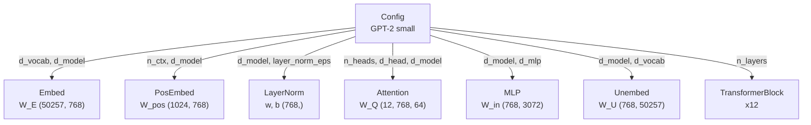
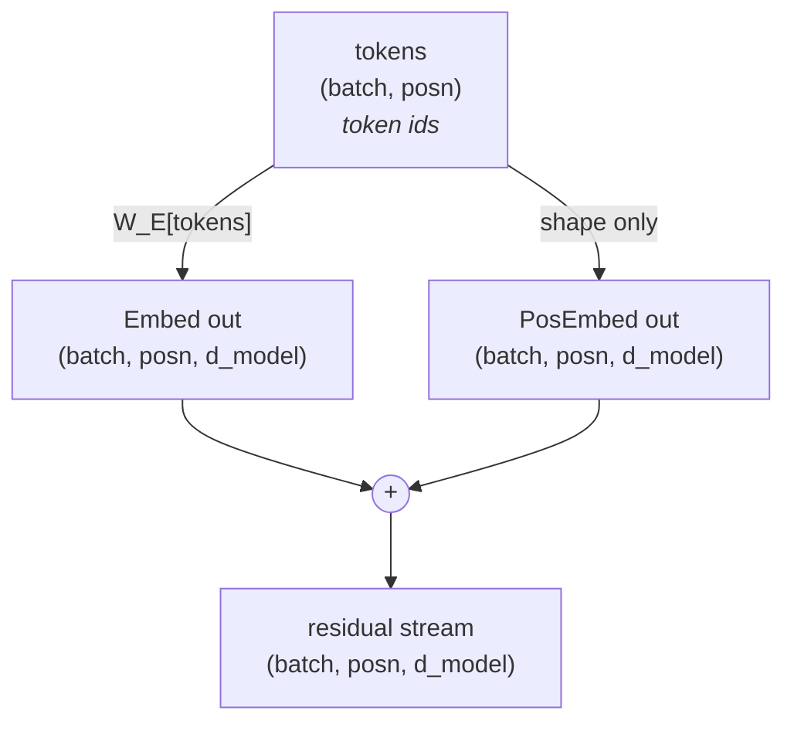
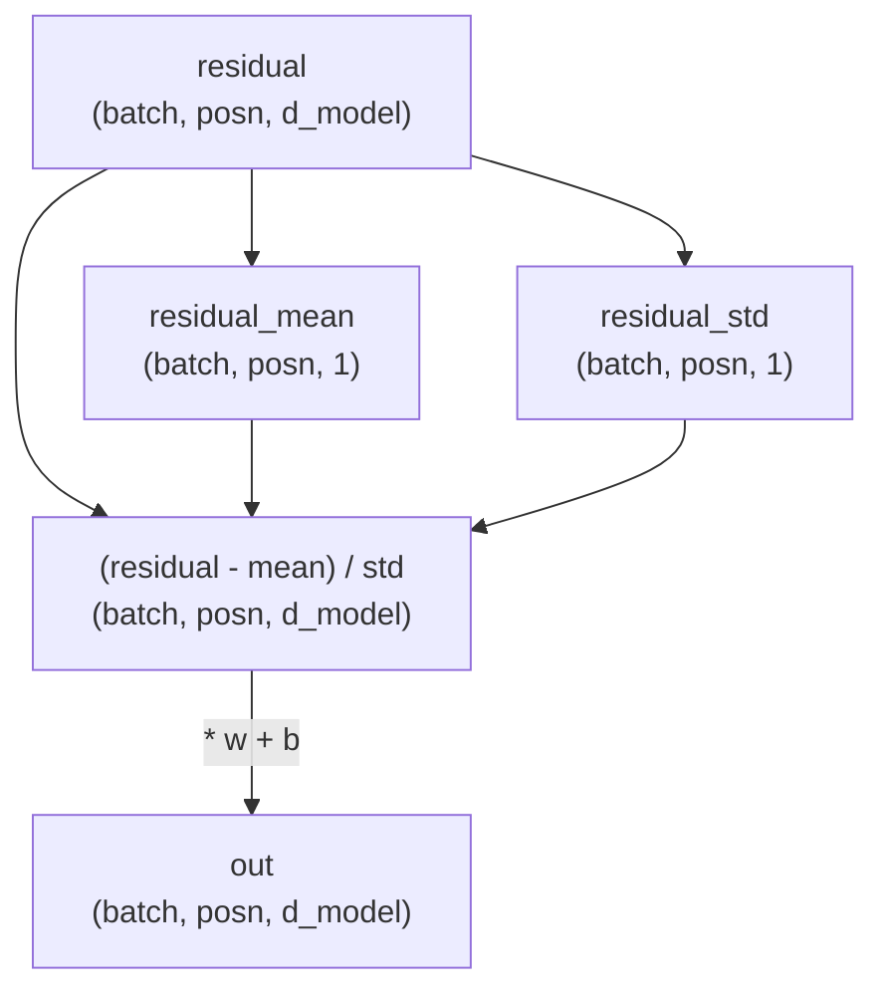
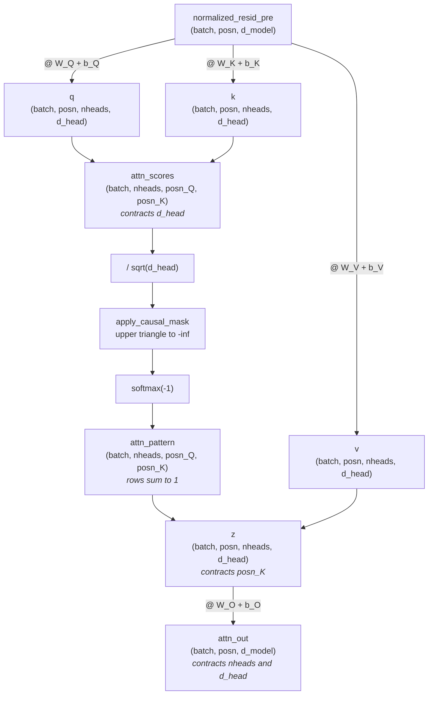
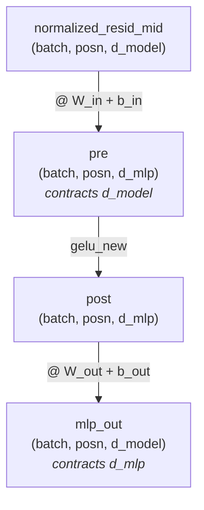
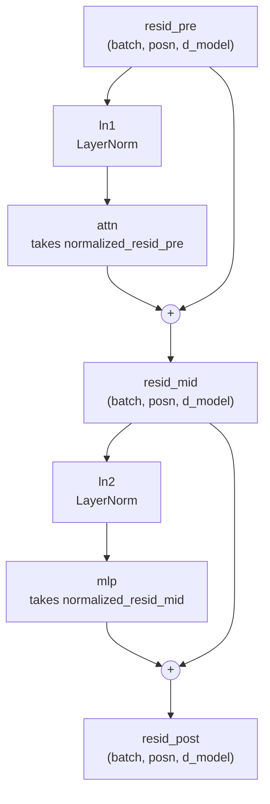
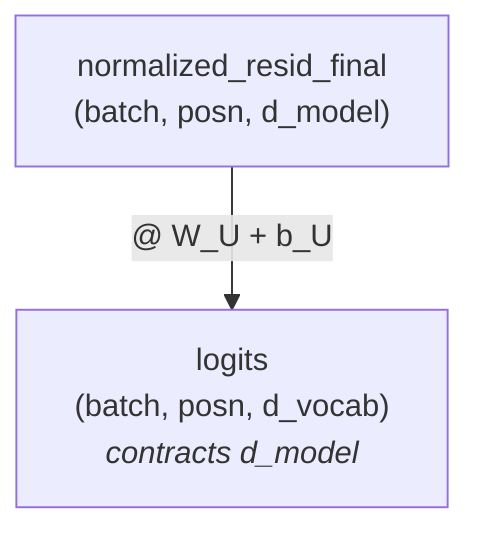
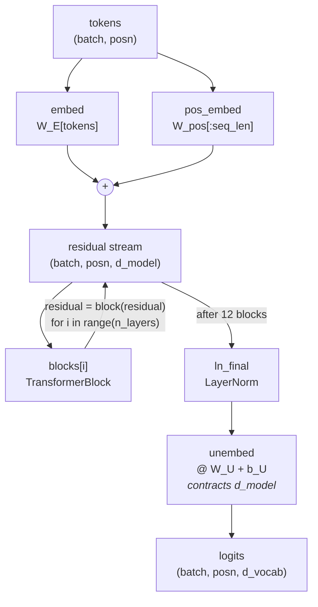

I've been self-studying ARENA, an AI-safety curriculum whose first chapter has you rebuild GPT-2 from scratch. Transformers were the gap I kept hitting. They're the core of every LLM, and the interpretability side I actually care about is hard to follow without understanding what sits underneath it.

So I ported the whole chapter into my own modular implementation, loading GPT-2's weights into each module as I went and comparing the output against the reference, until every module matched. These are my notes from doing that, module by module, with the shapes and diagrams I needed to follow it.

PvML: https://github.com/d0mzw/PvML

Disclaimer: these notes come from working through the ARENA 3.0 curriculum. I claim no credit for the original material, and this is not affiliated with or endorsed by ARENA.

## Config



```python
@dataclass
class Config:
    d_model: int = 768
    debug: bool = False  # per-module __main__ turns it on
    layer_norm_eps: float = 1e-5
    d_vocab: int = 50257
    init_range: float = 0.02
    n_ctx: int = 1024
    d_head: int = 64
    d_mlp: int = 3072
    n_heads: int = 12
    n_layers: int = 12
```

## Embedding module



Integers become vectors here, and the two results are added to form the residual stream that every later layer reads from and writes back into.

`The cat sat on the mat` is tokenized first, in the shape `(batch, posn) = (1, 7)`.

```
ids             50256    464    3797    3332    319     262    2603
decoded <|endoftext|>  'The'  ' cat'  ' sat'  ' on'  ' the'  ' mat'
```

- `50256` is `<|endoftext|>`, prepended as the beginning-of-sequence marker

### `Embed`

Each token id is replaced by its row of `W_E` through lookup.

```python
self.W_E = nn.Parameter(t.empty((cfg.d_vocab, cfg.d_model)))

out = self.W_E[tokens]
```

```
(d_vocab, d_model)[(batch, posn)]  ->  (batch, posn, d_model)
 50257    768       1      7            1      7     768
```

### `PosEmbed`

Only the shape of `tokens` is read, because position embeddings encode where a token sits rather than which token it is.

```python
self.W_pos = nn.Parameter(t.empty((cfg.n_ctx, cfg.d_model)))

batch, seq_len = tokens.shape
sliced = self.W_pos[:seq_len]
out = einops.repeat(sliced, "seq d_model -> batch seq d_model", batch=batch)
```

- `W_pos` is an `(n_ctx, d_model)` matrix, and its `n_ctx` rows are sliced down to `seq_len` = `posn` = 7
- `repeat` copies that sliced table for every sequence in the batch

### Module output

```bash
(.venv) dom@dom-z13:~/Desktop/PvML$ python -m pvml.modules.embedding
text='The cat sat on the mat'
ref.to_str_tokens(text)=['<|endoftext|>', 'The', ' cat', ' sat', ' on', ' the', ' mat']
tokens.shape=torch.Size([1, 7])

[embed]                       in: (1, 7)          # token ids, not activations
[embed]                      W_E: (50257, 768)    # one row per vocab entry
[embed]                      out: (1, 7, 768)
[pos_embed]                   in: (1, 7)          # values ignored, only the shape is read
[pos_embed]                W_pos: (1024, 768)     # one row per position, up to n_ctx rows
[pos_embed]               sliced: (7, 768)        # W_pos[:seq_len]
[pos_embed]                  out: (1, 7, 768)     # same table repeated for each sequence
```

## LayerNorm



A residual stream of shape `(batch, posn, d_model)` comes in, and each position's `d_model` vector is standardised on its own by `(residual - mean) / sqrt(var + eps)`, with the mean and variance taken across `d_model` rather than across positions or the batch. The learned `w` and `b` then scale and shift it, and the normalised residual stream leaves at the shape it arrived in.

### Statistics

The two numbers each position gets standardised by.

```python
residual_mean = residual.mean(dim=-1, keepdim=True)
residual_std = (residual.var(dim=-1, keepdim=True, unbiased=False) + self.cfg.layer_norm_eps).sqrt()
```

- Reduced along `d_model`, deriving both the mean and the std in the shape `(batch, posn, 1)` = `(1, 7, 1)`. Each of those 7 values is computed from one position's own 768 numbers
- `keepdim=True` leaves the reduced axis as size 1 so it broadcasts back: `(1, 7, 768) - (1, 7, 1)` works, `(1, 7, 768) - (1, 7)` does not
- `unbiased=False` divides by `N`, not `N-1`, which is 768 not 767
- `layer_norm_eps` is a tiny constant, 1e-5, added to the variance before the sqrt so the denominator can never be zero. A position whose 768 numbers are all identical has a variance of 0, and dividing by that would give NaN

### Scale and shift

The learned half of the layer, applied once the standardising is done.

```python
self.w = nn.Parameter(t.ones(cfg.d_model))
self.b = nn.Parameter(t.zeros(cfg.d_model))

residual = (residual - residual_mean) / residual_std
out = residual * self.w + self.b
```

- `w` and `b` are both `(d_model,)` = `(768,)`, and they start as all ones and all zeros, so before any training `out` is exactly the standardised residual and the layer does nothing of its own
- One `w` and one `b` per LayerNorm, reused at all 7 positions, while the mean and std were worked out per position. The normalisation is local, the learned correction on top of it is not
- Broadcasting pads the missing leading axes: in `(1, 7, 768) * (768,)` the `w` is read as `(1, 1, 768)` and stretched to `(1, 7, 768)`
- Standardising throws the input's scale away, so `[1, 2, 3, 4]` and `[10, 20, 30, 40]` come out identical and after centering only the direction survives. `w` and `b` put a scale back, one the model has learned rather than one the input happened to arrive with

### Module output

```bash
(.venv) dom@dom-z13:~/Desktop/PvML$ python -m pvml.modules.normalization
[ln]                    residual: (1, 7, 768)     # as it arrives
[ln]               residual_mean: (1, 7, 1)
[ln]                residual_std: (1, 7, 1)
[ln]                    residual: (1, 7, 768)     # reassigned: (residual - mean) / std
[ln]                        w, b: (768,)          # padded to (1, 1, d_model), stretched to out
[ln]                         out: (1, 7, 768)     # * w + b
```

## Attention module



Each position asks what it needs (`q`), every earlier position advertises what it has (`k`), and the match decides how much of their content (`v`) gets copied back.

### `q, k, v`

All three read the same input through three different learned matrices. Same einsum, same output shape, different weights.

```python
q = (
    einops.einsum(
        normalized_resid_pre,
        self.W_Q,
        "batch posn d_model, nheads d_model d_head -> batch posn nheads d_head",
    )
    + self.b_Q
)
```

`k` and `v` are the same three lines again, reading the same `normalized_resid_pre` through `W_K`, `b_K` and `W_V`, `b_V`.

```
batch posn d_model,  nheads d_model d_head  ->  batch posn nheads d_head
1     7    768       12     768     64          1     7     12    64
           ▲                ▲
```

- `d_model` appears in both inputs and not in the output, so it is summed away. Each position's 768 numbers become 64 per head
- `nheads` and `d_head` come from the weight, `batch` and `posn` pass straight through
- `W_Q` is `(nheads, d_model, d_head)` = `(12, 768, 64)`, one projection per head stacked on a leading axis, so all 12 heads run as a single batched matmul rather than 12 separate modules
- `b_Q` is `(nheads, d_head)` = `(12, 64)`, read as `(1, 1, 12, 64)` and stretched: the same bias at every position, a different one per head

### `attn_scores`

For each head, dot every query vector (`q`) with every key vector (`k`) over `d_head`, giving a `(posn_Q, posn_K)` grid of match scores per head.

```python
attn_scores = einops.einsum(
    q,
    k,
    "batch posn_Q nheads d_head, batch posn_K nheads d_head -> batch nheads posn_Q posn_K",
)
```

- `d_head` is contracted, so the 64 numbers of a query and a key collapse to one score
- `batch` and `nheads` appear in both inputs *and* the output, so they are batched over rather than summed: an independent 7 x 7 grid per sequence per head
- The two position axes get different names so they survive as separate dimensions. `posn_Q` is who is asking, `posn_K` is who is being read
- These scores are raw. For entries of roughly unit variance the dot product of two 64-dimensional vectors has a standard deviation that grows like `sqrt(d_head)`, so dividing by `sqrt(64)` = 8 is exactly what cancels it. That pulls them back to a range where softmax does not saturate into a near one-hot row and kill the gradients

### `apply_causal_mask(attn_scores)`

Set everything above the diagonal of the scaled scores to `-inf`, so no position can attend to a later one.

```python
all_ones = t.ones(attn_scores.size(-2), attn_scores.size(-1), device=attn_scores.device)
mask = t.triu(all_ones, diagonal=1).bool()
attn_scores.masked_fill_(mask, self.IGNORE)
```

```
        k0 k1 k2 k3 k4 k5 k6
    q0 [ 0  1  1  1  1  1  1 ]    1 = masked, the future
    q1 [ 0  0  1  1  1  1  1 ]
    q2 [ 0  0  0  1  1  1  1 ]
    q3 [ 0  0  0  0  1  1  1 ]
    q4 [ 0  0  0  0  0  1  1 ]
    q5 [ 0  0  0  0  0  0  1 ]
    q6 [ 0  0  0  0  0  0  0 ]
```

- `diagonal=1` leaves the diagonal unmasked, so a position can attend to itself
- The mask is 2-D `(7, 7)` and broadcasts over `batch` and `nheads`. Causality depends only on position, so every sequence and every head gets the same one
- `IGNORE` is a registered buffer, so `-inf` follows `.to(device)`. `all_ones` needs an explicit `device=` because a tensor made inside a method does not
- `masked_fill_` is in place: it mutates `attn_scores`

### `attn_pattern`

Softmax each row into a distribution over the keys it can see.

```python
attn_scores_masked = self.apply_causal_mask(attn_scores / self.cfg.d_head**0.5)
attn_pattern = attn_scores_masked.softmax(-1)
```

- The mask has to land before the softmax, not after, so `exp(-inf)` = 0 never enters the denominator and the surviving weights still sum to 1
- Shape is unchanged throughout, `(1, 12, 7, 7)`. Row `q3` of each head now holds four non-zero weights summing to 1, and three zeros

### `z`

Weighted average of `v` for each query position, contracting `posn_K`.

```python
z = einops.einsum(
    v,
    attn_pattern,
    "batch posn_K nheads d_head, batch nheads posn_Q posn_K -> batch posn_Q nheads d_head",
)
```

- `posn_K` is the contracted axis, so the sum runs over the positions being *read*. `posn_Q` survives, so the result is indexed by the position doing the asking
- Concretely, at query position 3: its row of `attn_pattern` holds four non-zero weights, and `z` at that position is those four value vectors each multiplied by its weight and added together, separately for each of the 12 heads. The three masked positions carry weight 0, so they contribute nothing
- `z` comes out the same shape as `v`, `(1, 7, 12, 64)`. Nothing changed size. What changed is that each position's vector is now a blend of the positions it could see, instead of only its own
- This is the only step in the whole model where information crosses between positions. Embedding, LayerNorm and the MLP all act on each position independently, so every bit of context a token ever gets arrives through this one sum

### `attn_out`

Project each head's `d_head` back up to `d_model` and sum over the heads.

```python
attn_out = (
    einops.einsum(
        z,
        self.W_O,
        "batch posn_Q nheads d_head, nheads d_head d_model -> batch posn_Q d_model",
    )
    + self.b_O
)
```

- `W_O` is `(nheads, d_head, d_model)` = `(12, 64, 768)`, the reverse of `W_Q`, `W_K` and `W_V`. Those project the residual stream down into each head's 64 dimensions, this one projects the result back up to 768
- Two names are contracted at once, `nheads` and `d_head`, so the 12 heads are **summed, not concatenated**. Each head's 64 numbers become a full 768-wide vector, and the 12 vectors are added
- `b_O` is `(d_model,)` = `(768,)`, with no head axis, because it is added once after the heads are already summed. Compare `b_Q`, which is `(12, 64)` and applies per head
- Output is `(1, 7, 768)`, back to the residual stream's width, ready to be added into it

### Module output

```bash
(.venv) dom@dom-z13:~/Desktop/PvML$ python -m pvml.modules.attention
 W_Q: (12, 768, 64)
 W_K: (12, 768, 64)
 W_V: (12, 768, 64)
 W_O: (12, 64, 768)
 b_Q: (12, 64)
 b_K: (12, 64)
 b_V: (12, 64)
 b_O: (768,)
total: 2,362,368 parameters

Loaded pretrained model gpt2-small into HookedTransformer
[attn]      normalized_resid_pre: (1, 7, 768)     # (batch, posn, d_model)
[attn]                       W_Q: (12, 768, 64)   # (n_heads, d_model, d_head)
[attn]                       b_Q: (12, 64)        # (n_heads, d_head), broadcast over posn
[attn]                         q: (1, 7, 12, 64)  # (batch, posn, n_heads, d_head)
[attn]                       W_K: (12, 768, 64)
[attn]                       b_K: (12, 64)
[attn]                         k: (1, 7, 12, 64)
[attn]                       W_V: (12, 768, 64)
[attn]                       b_V: (12, 64)
[attn]                         v: (1, 7, 12, 64)
[attn]               attn_scores: (1, 12, 7, 7)   # (batch, n_heads, query_pos, key_pos)
[attn]                      mask: (7, 7)          # True above the diagonal = cannot attend
[attn]              attn_pattern: (1, 12, 7, 7)   # rows sum to 1 over visible keys
[attn]                         z: (1, 7, 12, 64)  # weighted average of v, per query position
[attn]                       W_O: (12, 64, 768)   # (n_heads, d_head, d_model), projects back up
[attn]                  attn_out: (1, 7, 768)     # back to the residual stream's width

head 0 attention pattern
   query / key   <BOS>     The     cat     sat      on     the     mat
         <BOS>    1.00    0.00    0.00    0.00    0.00    0.00    0.00
           The    0.93    0.07    0.00    0.00    0.00    0.00    0.00
           cat    0.71    0.10    0.18    0.00    0.00    0.00    0.00
           sat    0.64    0.14    0.04    0.18    0.00    0.00    0.00
            on    0.48    0.15    0.12    0.23    0.03    0.00    0.00
           the    0.60    0.12    0.09    0.16    0.02    0.02    0.00
           mat    0.37    0.09    0.06    0.03    0.08    0.10    0.26
```

## MLP



Expand to four times the residual width, apply the nonlinearity, project back. Every position goes through the same matrices independently, so nothing here mixes positions.

### `pre`

The first of the two projections, into the wide space.

```python
self.W_in = nn.Parameter(t.empty((cfg.d_model, cfg.d_mlp)))

pre = (
    einops.einsum(
        normalized_resid_mid,
        self.W_in,
        "batch position d_model, d_model d_mlp -> batch position d_mlp",
    )
    + self.b_in
)
```

- `W_in` is 2-D. The MLP has no head axis, unlike attention's weights
- `d_model` contracts, `d_mlp` appears: 768 in, 3072 out
- Input is the residual stream after attention has been added, through the block's `ln2`

### `post`

The only nonlinearity in the MLP.

```python
post = gelu_new(pre)
```

- Without it `W_in` and `W_out` would collapse into a single matrix and the whole detour through 3072 dimensions would buy nothing
- Applied elementwise in the wide space, so the shape does not change

### `mlp_out`

The second projection, undoing the expansion.

```python
self.W_out = nn.Parameter(t.empty((cfg.d_mlp, cfg.d_model)))

mlp_out = (
    einops.einsum(
        post,
        self.W_out,
        "batch position d_mlp, d_mlp d_model -> batch position d_model",
    )
    + self.b_out
)
```

- `d_mlp` contracts: 3072 in, 768 out, back to the width the block adds into
- `b_out` is `(d_model,)`, broadcast over batch and position

### Module output

```bash
(.venv) dom@dom-z13:~/Desktop/PvML$ python -m pvml.modules.mlp
  W_in: (768, 3072)
 W_out: (3072, 768)
  b_in: (3072,)
 b_out: (768,)
 total: 4,722,432 parameters

[mlp]       normalized_resid_mid: (1, 7, 768)     # (batch, posn, d_model)
[mlp]                       W_in: (768, 3072)     # (d_model, d_mlp), contracts d_model
[mlp]                        pre: (1, 7, 3072)    # 4x wider than the residual stream
[mlp]                       post: (1, 7, 3072)    # gelu_new, same shape
[mlp]                      W_out: (3072, 768)     # (d_mlp, d_model), contracts d_mlp
[mlp]                    mlp_out: (1, 7, 768)     # back to (batch, posn, d_model)

max abs diff vs gpt-2: 0.000e+00
```

- 4.7M parameters, twice what attention costs. Two thirds of a block is the MLP
- `d_mlp = 4 * d_model` is convention, not a requirement

## TransformerBlock



Attention and the MLP each read the stream and add a delta back. Neither replaces it, so every component's contribution stays separable.

### `resid_mid`

Attention reads the normalised stream and its output is added back.

```python
resid_mid = self.attn(self.ln1(resid_pre)) + resid_pre
```

- `ln1` normalises what attention **reads**. What gets added back is the unnormalised `attn_out`, so the stream itself never passes through a LayerNorm
- The stream keeps its width the whole way: 768 in, 768 out, at every point in all 12 blocks

### `resid_post`

The MLP's turn, on the stream attention just wrote into.

```python
resid_post = self.mlp(self.ln2(resid_mid)) + resid_mid
```

- `ln2` normalises what the MLP reads, exactly as `ln1` did for attention
- `(1, 7, 3072)` inside the MLP and `(1, 7, 12, 64)` inside attention are private scratch space, projected back before anything is added

### Module output

```bash
(.venv) dom@dom-z13:~/Desktop/PvML$ python -m pvml.modules.block
block parameters: 7,087,872

[block]                resid_pre: (1, 7, 768)     # (batch, posn, d_model)
[ln1]                   residual: (1, 7, 768)     # as it arrives
[ln1]              residual_mean: (1, 7, 1)
[ln1]               residual_std: (1, 7, 1)
[ln1]                   residual: (1, 7, 768)     # reassigned: (residual - mean) / std
[ln1]                       w, b: (768,)          # padded to (1, 1, d_model), stretched to out
[ln1]                        out: (1, 7, 768)     # * w + b
[attn]      normalized_resid_pre: (1, 7, 768)     # (batch, posn, d_model)
[attn]                         q: (1, 7, 12, 64)  # (batch, posn, n_heads, d_head)
[attn]               attn_scores: (1, 12, 7, 7)   # (batch, n_heads, query_pos, key_pos)
[attn]              attn_pattern: (1, 12, 7, 7)   # rows sum to 1 over visible keys
[attn]                         z: (1, 7, 12, 64)  # weighted average of v, per query position
[attn]                  attn_out: (1, 7, 768)     # back to the residual stream's width
[block]                resid_mid: (1, 7, 768)     # resid_pre + attn_out
[ln2]                   residual: (1, 7, 768)     # as it arrives
[ln2]                        out: (1, 7, 768)     # * w + b
[mlp]       normalized_resid_mid: (1, 7, 768)     # (batch, posn, d_model)
[mlp]                        pre: (1, 7, 3072)    # 4x wider than the residual stream
[mlp]                       post: (1, 7, 3072)    # gelu_new, same shape
[mlp]                    mlp_out: (1, 7, 768)     # back to (batch, posn, d_model)
[block]               resid_post: (1, 7, 768)     # resid_mid + mlp_out

max abs diff vs gpt-2: 1.144e-05
```

- First module where the diff is not exactly zero. Values reach 120, so 1e-5 is float32 accumulation across the four sub-modules of a block, not an error
- `tag_tree` names the children by position, so the two LayerNorms print as `ln1` and `ln2`

## Unembed



One score per vocabulary entry, per position. This is where `d_model` becomes `d_vocab` and the model commits to a prediction.

### `logits`

A single matmul against a `(768, 50257)` table, the mirror of `W_E`.

```python
self.W_U = nn.Parameter(t.empty((cfg.d_model, cfg.d_vocab)))
self.b_U = nn.Parameter(t.zeros((cfg.d_vocab)), requires_grad=False)

logits = (
    einops.einsum(
        normalized_resid_final,
        self.W_U,
        "batch posn d_model, d_model d_vocab -> batch posn d_vocab",
    )
    + self.b_U
)
```

- `b_U` is frozen. GPT-2 has no unembedding bias, so it stays at zero and only exists to keep the shapes lined up
- Input is the stream after all twelve blocks, through `ln_final`
- `d_vocab` appears in only two places in the whole model, here and at `W_E`. Everything between them is `d_model`

### Module output

```bash
(.venv) dom@dom-z13:~/Desktop/PvML$ python -m pvml.modules.unembedding
 W_U: (768, 50257)  requires_grad=True
 b_U: (50257,)  requires_grad=False
total: 38,647,633 parameters

[unembed]   normalized_resid_final: (1, 7, 768)     # (batch, posn, d_model)
[unembed]                      W_U: (768, 50257)    # (d_model, d_vocab), the mirror of W_E
[unembed]                   logits: (1, 7, 50257)   # one score per vocab entry

max abs diff vs gpt-2: 0.000e+00

next-token predictions
     <BOS>  ->  '\n'
       The  ->  ' first'
       cat  ->  ' was'
       sat  ->  ' on'
        on  ->  ' the'
       the  ->  ' floor'
       mat  ->  ','
```

- Every position predicts its own next token from one forward pass. That is what the causal mask is for
- `sat -> ' on'` and `on -> ' the'` are right. `the -> ' floor'` is a guess, because position 5 cannot see `' mat'`

## Transformer



Token ids in, logits out. The module owns no parameters of its own, it just wires the others together.

### `forward`

Embed, run the blocks in sequence, normalise, unembed.

```python
residual = self.embed(tokens) + self.pos_embed(tokens)

for block in self.blocks:
    residual = block(residual)

logits = self.unembed(self.ln_final(residual))
```

- `residual = block(residual)` only works because the shape never changes. That is why blocks stack
- Nothing normalises the stream itself along the way, so `ln_final` is needed before the unembedding can read it
- `nn.ModuleList` gives the children paths like `blocks.3.attn`, which match `transformer_lens`'s module paths. Its hooks are points underneath those, such as `blocks.3.attn.hook_z`, so the two trees line up and one vocabulary covers the trace and the reference activations

### Module output

```bash
(.venv) dom@dom-z13:~/Desktop/PvML$ python -m pvml.modules.transformer
parameters      : 163,087,441
missing keys    : []
unexpected keys : 12 (['mask'])

logits (1, 7, 50257)
max abs diff vs gpt-2: 9.155e-05
same argmax everywhere: True

next-token predictions
     <BOS>  ->  '\n'
       The  ->  ' first'
       cat  ->  ' was'
       sat  ->  ' on'
        on  ->  ' the'
       the  ->  ' floor'
       mat  ->  ','
```

The check loads GPT-2's whole `state_dict` into our model with `strict=False`, then runs both on the same tokens.

- `missing keys: []` is the line that matters. Every parameter our model needs was found in GPT-2's. Because `strict=False` tolerates a mismatch instead of raising, a single misspelled parameter would leave that weight at its random initialisation, and the model would still run and still produce plausible logits. An empty list is what rules that out
- `unexpected keys: 12` is the other direction, entries GPT-2 has that we do not. All 12 are named `mask`, one per block. `transformer_lens` precomputes its causal mask as a buffer, ours is built inside `apply_causal_mask` on every call, so there is nothing to load them into
- Every earlier check was handed its input from the reference's own activations. This one gets only token ids, so the entire forward pass is ours and no borrowed intermediate can prop up a mistake
- `9.155e-05` across 50,257 logits at each of 7 positions, and the argmax is identical at every one. That is float32 accumulation over twelve blocks, not an error

Where those parameters live:

```
  embed        38,597,376
  pos_embed       786,432
  blocks       85,054,464
  ln_final          1,536
  unembed      38,647,633
  total       163,087,441
```

- 85M of it is the twelve blocks, and two thirds of each block is its MLP
- GPT-2 small is usually quoted as 124M, which is this total minus `unembed`. The original ties the two vocabulary tables, `W_U = W_E` transposed, and counts those 38,597,376 parameters once. `transformer_lens` keeps them as separate tensors, so they are counted twice here
